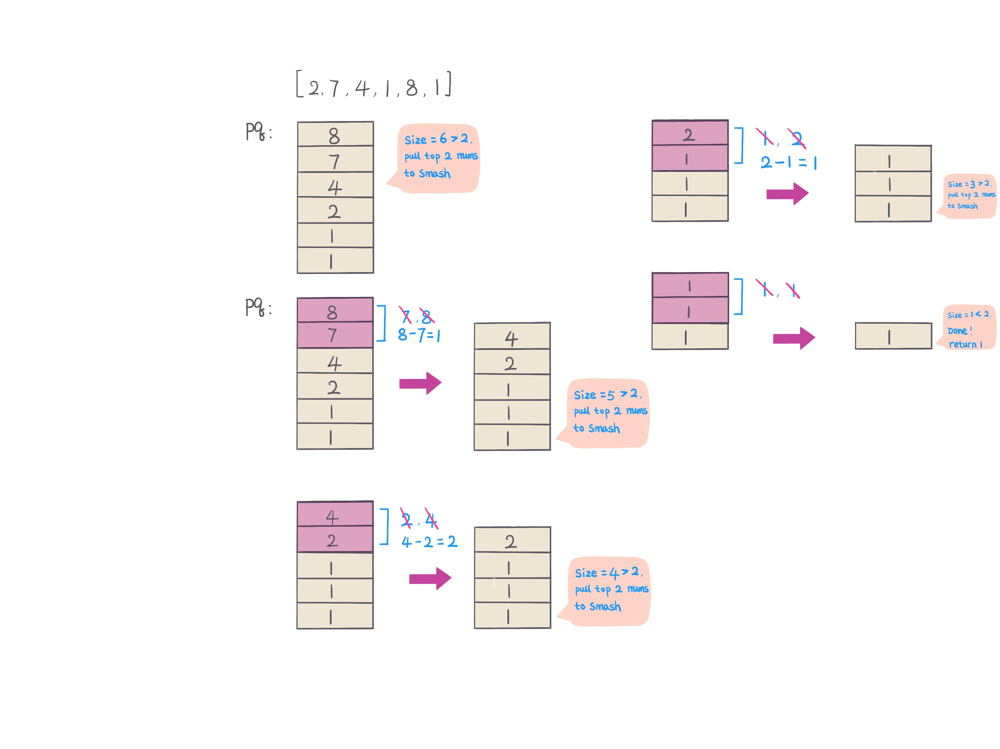

## Problem
[Last Stone Weight](https://leetcode.com/explore/challenge/card/30-day-leetcoding-challenge/529/week-2/3297/)

## Problem Description
```
We have a collection of stones, each stone has a positive integer weight.

Each turn, we choose the two heaviest stones and smash them together.  Suppose the stones have weights x and y with x <= y.  The result of this smash is:

If x == y, both stones are totally destroyed;
If x != y, the stone of weight x is totally destroyed, and the stone of weight y has new weight y-x.
At the end, there is at most 1 stone left.  Return the weight of this stone (or 0 if there are no stones left.)

Example 1:

Input: [2,7,4,1,8,1]
Output: 1
Explanation: 
We combine 7 and 8 to get 1 so the array converts to [2,4,1,1,1] then,
we combine 2 and 4 to get 2 so the array converts to [2,1,1,1] then,
we combine 2 and 1 to get 1 so the array converts to [1,1,1] then,
we combine 1 and 1 to get 0 so the array converts to [1] then that's the value of last stone.
 
Note:

1 <= stones.length <= 30
1 <= stones[i] <= 1000
```

## Solution
From problem description, notice that every time smash 2 heaviest stones, 
- if two heaviest stones weight not equal, put diff into stones array
- if two heaviest stones are equal, discard both

Use maximum priority queue to store stones, pull top 2 stones to do smash, until priority queue size <= 1, stop
- if priority queue size = 1, return last stone weight
- if no stone left in queue, return 0.


For example: 
 


####Complexity Analysis

**Time Complexity:** `O(NlogN)`

**Space Complexity:** `O(N)`

- N - the length of array stones.

#### Code
**Java code**
```java
class Solution {
    public int lastStoneWeight(int[] stones) {
        if (stones.length == 1) return stones[0];
        // init max priority queue
        PriorityQueue<Integer> pq = new PriorityQueue<>((a,b) -> b - a);
        pq.addAll(Arrays.stream(stones).boxed().collect(Collectors.toList()));
        // smash 2 heaviest stones each time
        while (pq.size() > 1) {
            int first = pq.poll();
            int second = pq.poll();
            if (first > second) pq.offer(first - second);
        }
        return pq.size() == 1 ? pq.poll() : 0;
    }
}
```

**Python code**
```python
class Solution:
    def lastStoneWeight(self, stones: List[int]) -> int:
        heap = [-num for num in stones]
        # init max heap
        heapq.heapify(heap)
        # smash two heaviest stones from heap each time
        while len(heap) > 1:
            diff = heapq.heappop(heap) - heapq.heappop(heap)
            if diff != 0:
                heapq.heappush(heap, diff)
        return -heap[0] if len(heap) == 1 else 0
```
