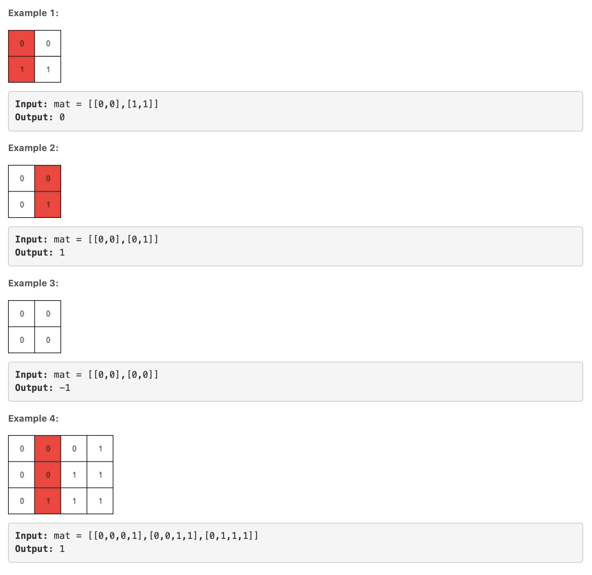
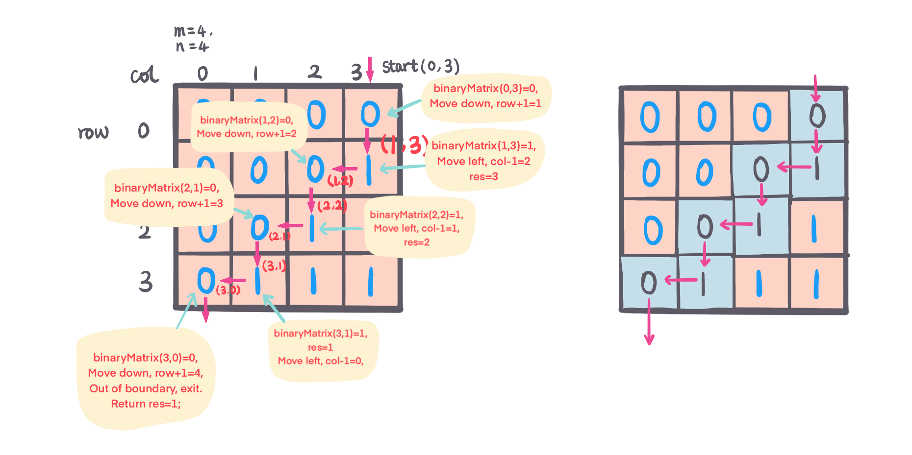

## Problem
[Leftmost Column with at Least a One](https://leetcode.com/explore/challenge/card/30-day-leetcoding-challenge/530/week-3/3306/)

## Problem Description
```
(This problem is an interactive problem.)

A binary matrix means that all elements are 0 or 1. For each individual row of the matrix, this row is sorted in non-decreasing order.

Given a row-sorted binary matrix binaryMatrix, return leftmost column index(0-indexed) with at least a 1 in it. If such index doesn't exist, return -1.

You can't access the Binary Matrix directly.  You may only access the matrix using a BinaryMatrix interface:

BinaryMatrix.get(x, y) returns the element of the matrix at index (x, y) (0-indexed).
BinaryMatrix.dimensions() returns a list of 2 elements [m, n], which means the matrix is m * n.
Submissions making more than 1000 calls to BinaryMatrix.get will be judged Wrong Answer.  Also, any solutions that attempt to circumvent the judge will result in disqualification.

For custom testing purposes you're given the binary matrix mat as input in the following four examples. You will not have access the binary matrix directly.
```

```
Constraints:

m == mat.length
n == mat[i].length
1 <= m, n <= 100
mat[i][j] is either 0 or 1.
mat[i] is sorted in a non-decreasing way.
```

## Solution

#### Solution #1 - Binary Search 
BinaryMatrix row is sorted, and find left most 1, binary search in `O(logN)`, record each row left most column index with 1, 
each row do binary search, and compare the left most column, keep track of min column number.
after iterate through all rows, return min.

####Complexity Analysis

**Time Complexity:** `O(MlogN)`

**Space Complexity:** `O(1)`

- M - the number of rows in binaryMatrix
- N - the number of columns in binaryMatrix

#### Code

```java
/**
 * // This is the BinaryMatrix's API interface.
 * // You should not implement it, or speculate about its implementation
 * interface BinaryMatrix {
 *     public int get(int x, int y) {}
 *     public List<Integer> dimensions {}
 * };
 */
class Solution {
    int max = 101;
    
    public int leftMostColumnWithOne(BinaryMatrix binaryMatrix) {
        List<Integer> dimension = binaryMatrix.dimensions();
        int m = dimension.get(0);
        int n = dimension.get(1);
        int min = max;
        for (int i = 0; i < m; i++) {
            min = Math.min(min, binarySearch(binaryMatrix, i, n));
        }
        return min == max ? -1 : min;
    }
    private int binarySearch(BinaryMatrix bm, int row, int n) {
        if (bm.get(row, n - 1) == 0) return max;
        if (bm.get(row, 0) == 1) return 0;
        int lo = 0;
        int hi = n - 1;
        while (lo <= hi) {
            int mid = lo + (hi - lo) / 2;
            if (bm.get(row, mid) == 1) {
              hi = mid - 1;
            } else {
              lo = mid + 1;
            }
        }
        return lo;
    }
}
```

#### Solutions #2 -- Linear Time
Start from up-right corner, (m, n) 
- init start position: `row = 0, col = n - 1, res = -1`
- if current position value, `binaryMatrix.get(row, col) = 1`, update `res = col, move left, row = row - 1`
- if current position, `binaryMatrix.get(row, col) = 0`, move down, `col = col - 1`
- continue until one dimension out of boundry. return res.

For example:



####Complexity Analysis

**Time Complexity:** `O(M+N)`

**Space Complexity:** `O(1)`

- M - the number of rows in binaryMatrix
- N - the number of columns in binaryMatrix
```java
/**
 * // This is the BinaryMatrix's API interface.
 * // You should not implement it, or speculate about its implementation
 * interface BinaryMatrix {
 *     public int get(int x, int y) {}
 *     public List<Integer> dimensions {}
 * };
 */
class Solution {
    public int leftMostColumnWithOne(BinaryMatrix binaryMatrix) {
        List<Integer> dimension = binaryMatrix.dimensions();
        int m = dimension.get(0);
        int n = dimension.get(1);
        int res = -1;
        int row = 0; int col = n - 1;
        while (row < m && col >= 0) {
            if (binaryMatrix.get(row, col) == 1) {
                res = col;
                col--;
            } else {
                row++;
            }
        }
        return res;
    }
}

```
