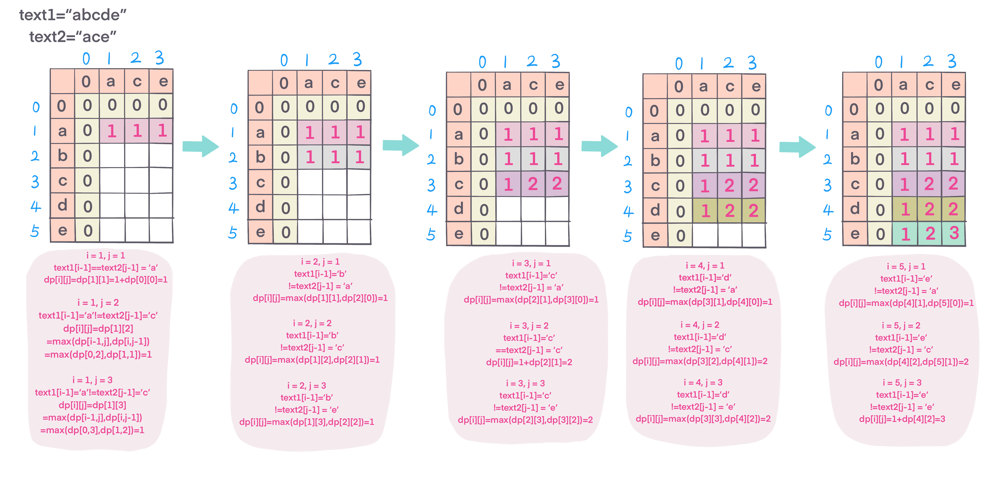

## Problem
[Longest Common Subsequece](https://leetcode.com/explore/other/card/30-day-leetcoding-challenge/531/week-4/3311/)

## Problem Description
```
Given two strings text1 and text2, return the length of their longest common subsequence.

A subsequence of a string is a new string generated from the original string with some characters(can be none) deleted without changing the relative order of the remaining characters. (eg, "ace" is a subsequence of "abcde" while "aec" is not). A common subsequence of two strings is a subsequence that is common to both strings.

If there is no common subsequence, return 0.

Example 1:

Input: text1 = "abcde", text2 = "ace" 
Output: 3  
Explanation: The longest common subsequence is "ace" and its length is 3.

Example 2:

Input: text1 = "abc", text2 = "abc"
Output: 3
Explanation: The longest common subsequence is "abc" and its length is 3.

Example 3:

Input: text1 = "abc", text2 = "def"
Output: 0
Explanation: There is no such common subsequence, so the result is 0.
```

## Solution

This is LCS, a Dynamic Programming (DP) problem, which can break down into smaller, simpler subproblems, and so on. DP problem usually reuse solutions to lower level subproblems.

We define `dp[m+1][n+1]` represents a set of longest common subsequect of prefiex Xi and Yj. given that:
- dp[0][0] = 0;
- if X[i - 1]==Y[j -1] (current character is the same), dp[i][j] = 1 + d[i - 1][j - 1]
- if X[i-1]!=Y[j-1], dp[i][j] = max(dp[i-1],j],dp[i][j-1])

repeat until computed the whole string, dp[m][n] is the answer.


For example: 
 



####Complexity Analysis

**Time Complexity:** `O(N*M)`

**Space Complexity:** `O(N*M)`

- N - the length of text1
- M - the length of text2

#### Code

```java
class Solution {
    public int longestCommonSubsequence(String text1, String text2) {
        if (text1.equals(text2)) return text1.length();
	    int m = text1.length();
	    int n = text2.length();
	    int[][] dp = new int[m + 1][n + 1];
        for (int i = 1; i <= m; i++) {
            for (int j = 1; j <= n; j++) {
                if (text1.charAt(i - 1) == text2.charAt(j - 1)) {
        	    dp[i][j] = 1 + dp[i - 1][j - 1];
        	} else {
        	    dp[i][j] = Math.max(dp[i - 1][j], dp[i][j - 1]);
        	}
        }
        return dp[m][n];
    }
}
```

## Reference 
- [Longest Common Subsequence Problem Wiki](https://en.wikipedia.org/wiki/Longest_common_subsequence_problem)
-
