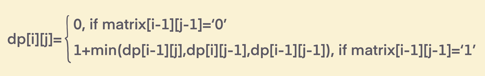
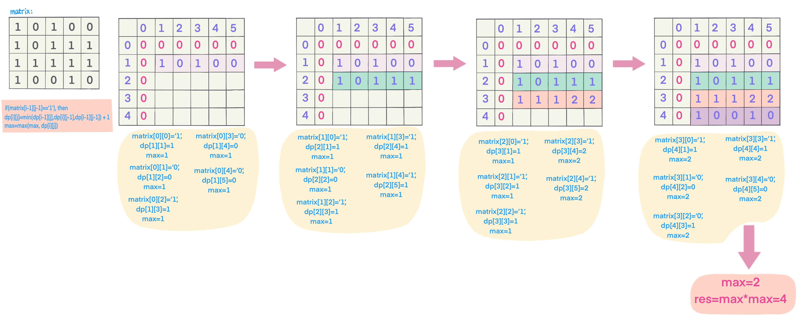

## Problem
[Maximal Square](https://leetcode.com/explore/challenge/card/30-day-leetcoding-challenge/531/week-4/3312/)

## Problem Description
```
Given a 2D binary matrix filled with 0's and 1's, find the largest square containing only 1's and return its area.

Example:

Input: 

1 0 1 0 0
1 0 1 1 1
1 1 1 1 1
1 0 0 1 0

Output: 4
```

## Solution

This is dynamic programming, which can solve it by breaking down into smaller subproblems. 
DP problem, the hard part is to come up with formular function, first we init dp:

- m, represents rows of the matrix
- n, represents columns of the matrix
- `dp[m+1][n+1]`

dp formular function:



for each `matrix[i-1][j-1]='1'`, update max, `max=max(max, dp[i][j]`

After iterate matrix, we get the maximum edge of square, `return max * max;`


For example: 



####Complexity Analysis

**Time Complexity:** `O(N*M)`

**Space Complexity:** `O(N*M)`

- N - the number of rows of matrix
- M - the number of columns of matrix

#### Code

```java
class Solution {
    public int maximalSquare(char[][] matrix) {
        if (matrix == null || matrix.length == 0 || matrix[0].length == 0) return 0;
        int max = 0;
        int row = matrix.length;
        int col = matrix[0].length;
        int[][] dp = new int[row + 1][col + 1];
        for (int r = 1; r <= row; r++) {
            for (int c = 1; c <= col; c++) {
                if (matrix[r - 1][c - 1] == '1') {
                    dp[r][c] = Math.min(dp[r][c - 1], Math.min(dp[r - 1][c], dp[r - 1][c - 1])) + 1;
                    max = Math.max(max, dp[r][c]);
                }
            }
        }
        return max * max;
    }
}
```
