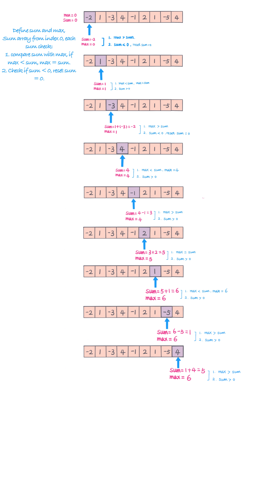

## Problem
[Maximum Subarray](https://leetcode.com/explore/challenge/card/30-day-leetcoding-challenge/528/week-1/3285/)

## Problem Description
```
Given an integer array nums, find the contiguous subarray (containing at least one number) which has the largest sum and return its sum.

Example:

Input: [-2,1,-3,4,-1,2,1,-5,4],
Output: 6
Explanation: [4,-1,2,1] has the largest sum = 6.

Follow up:
If you have figured out the O(n) solution, try coding another solution using the divide and conquer approach, which is more subtle.
```

## Solution 1 (linear)



```java
class Solution {
    public int maxSubArray(int[] nums) {
        // corner case check
        if (nums == null || nums.length == 0) return 0;
        int len = nums.length;
        int max = nums[0];
        int sum = 0;
        for (int i = 0; i < len; i++) {
            sum += nums[i];
            max = Math.max(sum, max);
            // reset sum to 0 when sum < 0.
            if (sum < 0) sum = 0;
        }
        return max;
    }
}
```

## Solution 2 (divide and conquer)
// TODO: add divide and conquer solution
