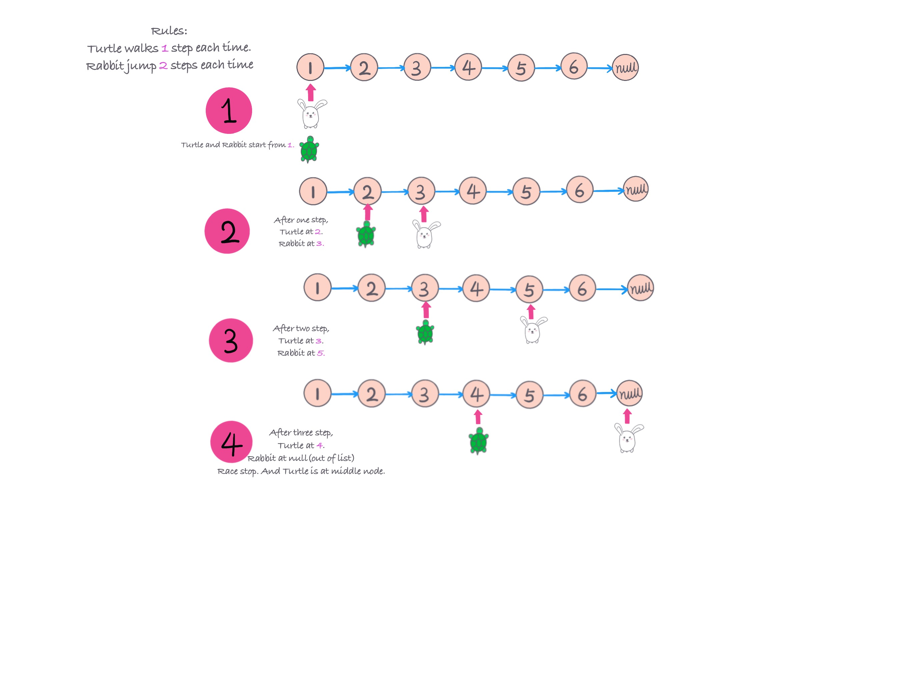

## Problem
[Middle of the Linked List](https://leetcode.com/explore/challenge/card/30-day-leetcoding-challenge/529/week-2/3290/)

## Problem Description
```
Given a non-empty, singly linked list with head node head, return a middle node of linked list.

If there are two middle nodes, return the second middle node.

Example 1:

Input: [1,2,3,4,5]
Output: Node 3 from this list (Serialization: [3,4,5])
The returned node has value 3.  (The judge's serialization of this node is [3,4,5]).
Note that we returned a ListNode object ans, such that:
ans.val = 3, ans.next.val = 4, ans.next.next.val = 5, and ans.next.next.next = NULL.
Example 2:

Input: [1,2,3,4,5,6]
Output: Node 4 from this list (Serialization: [4,5,6])
Since the list has two middle nodes with values 3 and 4, we return the second one.

Note:

The number of nodes in the given list will be between 1 and 100.
```

## Solution

Idea is to use slow and fast (turtle and rabbit) two nodes from head, slow node move 1 node each time, 

and fast node move 2 nodes each time, until fast is out of node, slow node is in the middle of the list node, return slow.



**Time complexity**: 
```
    O(N)
    N - the length of linkedlist
```

```java
 //Definition for singly-linked list.
public class ListNode {
     int val;
     ListNode next;
     ListNode(int x) { val = x; }
}

class Solution {
    public ListNode middleNode(ListNode head) {
        if (head == null || head.next == null) return head;
        ListNode slow = head;
        ListNode fast = head;
        while (fast != null && fast.next != null) {
            slow = slow.next;
            fast = fast.next.next;
        }
        return slow;
    }
}
```

