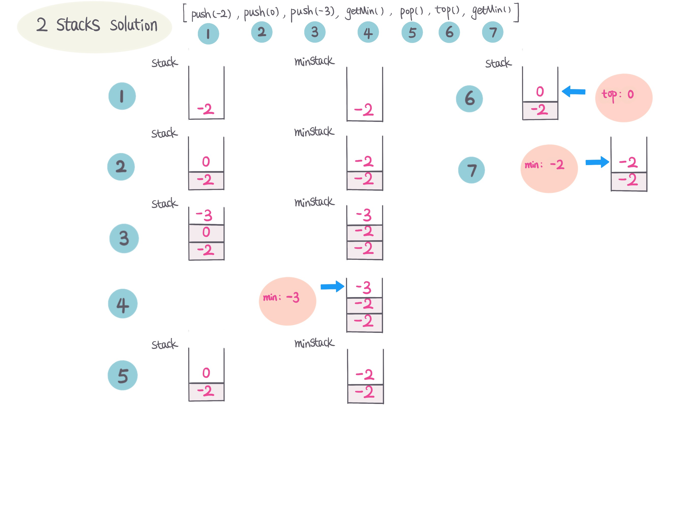
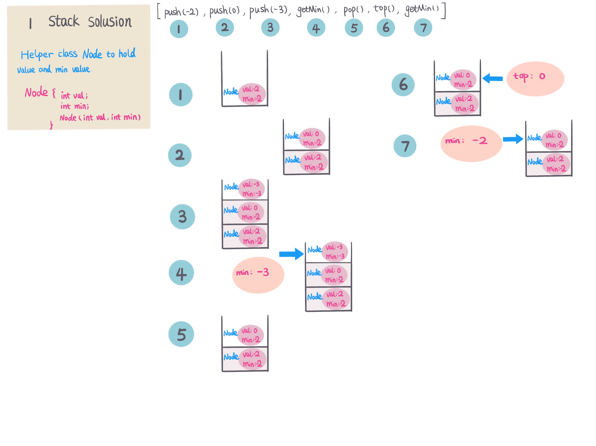

## Problem
[Min Stack](https://leetcode.com/explore/challenge/card/30-day-leetcoding-challenge/529/week-2/3292/)

## Problem Description
```
Design a stack that supports push, pop, top, and retrieving the minimum element in constant time.

push(x) -- Push element x onto stack.
pop() -- Removes the element on top of the stack.
top() -- Get the top element.
getMin() -- Retrieve the minimum element in the stack.
 

Example:

MinStack minStack = new MinStack();
minStack.push(-2);
minStack.push(0);
minStack.push(-3);
minStack.getMin();   --> Returns -3.
minStack.pop();
minStack.top();      --> Returns 0.
minStack.getMin();   --> Returns -2.
```

## Solution 1 (two stack)
Intuitive solution is to use 2 stacks, one stack to maintain value, and one stack to maintain min value.

For example: 
 



####Complexity Analysis

**Time Complexity:** `O(N)`

**Space Complexity:** `O(N)`

#### Code

```java
class MinStack {
    Stack<Integer> stack;
    Stack<Integer> minStack;
    /** initialize your data structure here. */
    public MinStack() {
        stack = new Stack<>();
        minStack = new Stack<>();
    }
    
    public void push(int x) {
        stack.push(x);
        int curr = minStack.isEmpty() ? x : minStack.peek();
        minStack.push(curr > x ? x : curr);
    }
    
    public void pop() {
        stack.pop();
        minStack.pop();
    }
    
    public int top() {
        return stack.peek();
    }
    
    public int getMin() {
        return minStack.peek();
    }
}
```

## Solution 2 (one stack)
From solution 1, we observe that we maintain 2 stacks every operation and 1 stack to keep one state, and with that thought,
we can use one stack to maintain 2 states, how to maintain 2 states in one action, using helper class. 

helper class Node with value and min value, and stack to maintain Node status.

for example:




####Complexity Analysis

**Time Complexity:** `O(N)`
 
**Space Complexity:** `O(N)`

#### Code 
```java
class MinStack {
    Stack<Node> stack;

    /** initialize your data structure here. */
    public MinStack() {
        stack = new Stack<>();
    }
    
    public void push(int x) {
        if (stack.isEmpty()) {
            stack.push(new Node(x, x));
        } else {
            Node top = stack.peek();
            stack.push(top.min < x ? new Node(x, top.min) : new Node(x, x));
        }
    }
    
    public void pop() {
        stack.pop();
    }
    
    public int top() {
        return stack.peek().val;
    }
    
    public int getMin() {
        return stack.peek().min;
    }
    class Node {
        int val;
        int min;
        public Node(int val, int min) {
            this.val = val;
            this.min = min;
        }
    }
}
```

