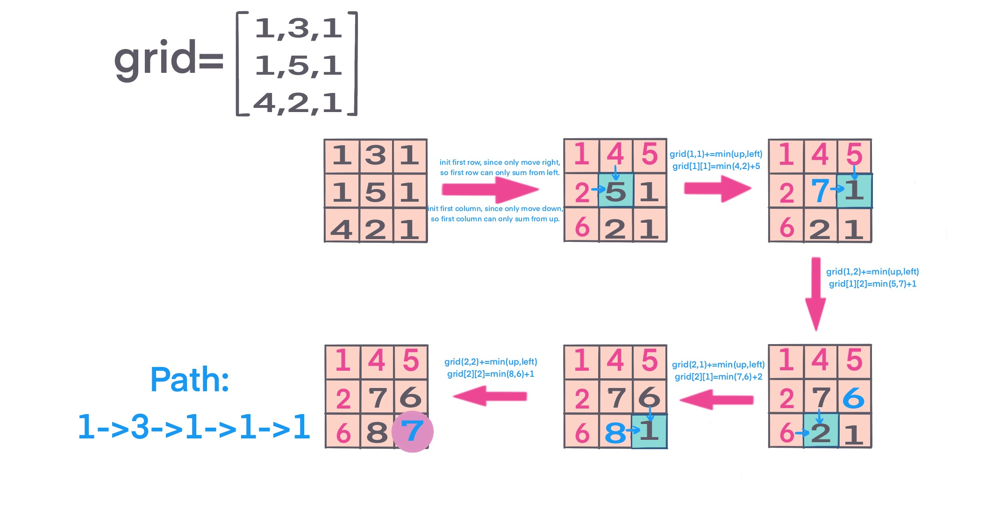

## Problem
[Minimum Path Sum](https://leetcode.com/explore/challenge/card/30-day-leetcoding-challenge/530/week-3/3303/)

## Problem Description
```
Given a m x n grid filled with non-negative numbers, find a path from top left to bottom right which minimizes the sum of all numbers along its path.

Note: You can only move either down or right at any point in time.

Example:

Input:
[
  [1,3,1],
  [1,5,1],
  [4,2,1]
]
Output: 7
Explanation: Because the path 1→3→1→1→1 minimizes the sum.
```

## Solution
This is a simple DP problem, current sum can either come from up or left, since it can only move down or right.

For each sum, `grid[r][c] = min(grid[r-1][c], grid[r][c-1]) + grid[r][c];` then you find the min path to current position (r,c).

after scan the whole grid, return bottom right value.
 
NOTE: Below implementation, modified original input grid, from algorithm point of view to reduce space complexity to `O(1)`. 
But from real project, modified original input not recommended, use extra space.

For example: 
 



####Complexity Analysis

**Time Complexity:** `O(N*M)`

**Space Complexity:** `O(1)`

- N - number of grid rows
- M - number of grid columns

#### Code

```java
class Solution {
    public int minPathSum(int[][] grid) {
        if (grid == null || grid.length == 0 || grid[0].length == 0) return 0;
        int row = grid.length;
        int col = grid[0].length;
        // init first row, since only move down or right, first line can only move from left to right
        for (int c = 1; c < col; c++) {
            grid[0][c] += grid[0][c - 1];
        }
        // init first col, only move down
        for (int r = 1; r < row; r++) {
            grid[r][0] += grid[r - 1][0];
        }
        for (int r = 1; r < row; r++) {
            for (int c = 1; c < col; c++) {
                grid[r][c] += Math.min(grid[r - 1][c], grid[r][c - 1]);
            }
        }
        return grid[row - 1][col - 1];
    }
}
```
