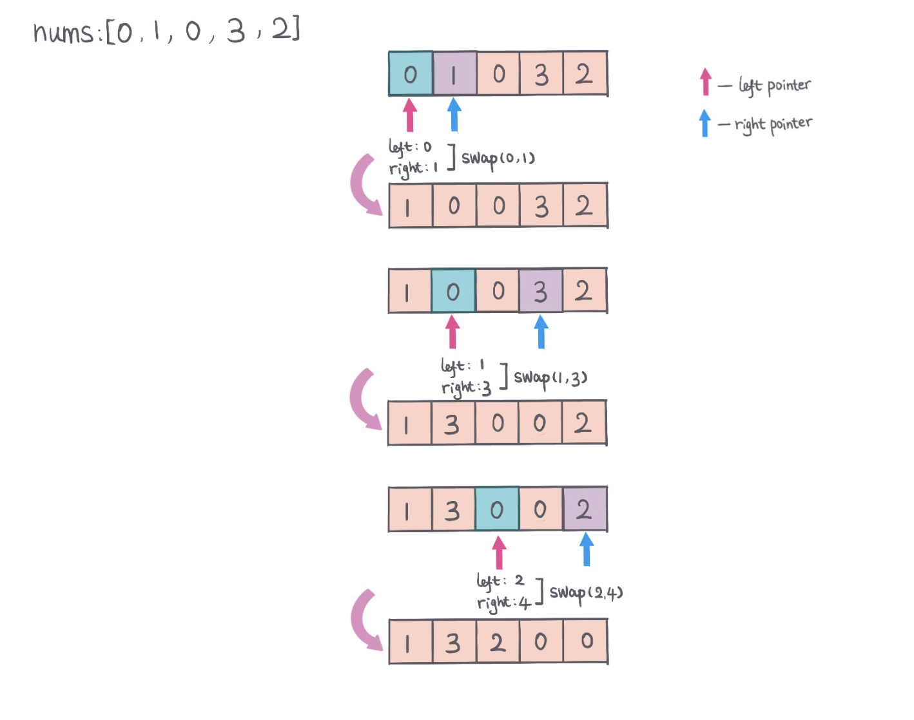

## Problem
[Move Zeroes](https://leetcode.com/explore/challenge/card/30-day-leetcoding-challenge/528/week-1/3286/)

## Problem Description
```
Given an array nums, write a function to move all 0's to the end of it while maintaining the relative order of 
the non-zero elements.

Example:

Input: [0,1,0,3,12]
Output: [1,3,12,0,0]
Note:

You must do this in-place without making a copy of the array.
Minimize the total number of operations.
```

## Solution
Two pointer (left, right), left keep track most left zero number position, right keep track of left most non-zero number position,
then do swap(left, right). 
Continue the process until the end of array nums.

For example: 



####Complexity Analysis

**Time Complexity:** `O(N)`

**Space Complexity:** `O(1)`

- N - the length of array nums

#### Code

```java
class Solution {
    public void moveZeroes(int[] nums) {
        if (nums == null || nums.length < 2) return;
        int l = 0;
        int r = 1;
        int len = nums.length;
        while (l < len && r < len) {
            // Find left most zero position
            while (l < len && nums[l] != 0) {
                l++;
            }
            if (r < l) {
                r = l + 1;
            }
            // find left most non zero position
            while (r < len && nums[r] == 0) {
                r++;
            }
            // if out of array, break
            if (r >= len) return;
            // swap zero and non zero
            swap(nums, l, r);
        }
    }
    private void swap(int[] nums, int a, int b) {
        int temp = nums[a];
        nums[a] = nums[b];
        nums[b] = temp;
    }
}
```
