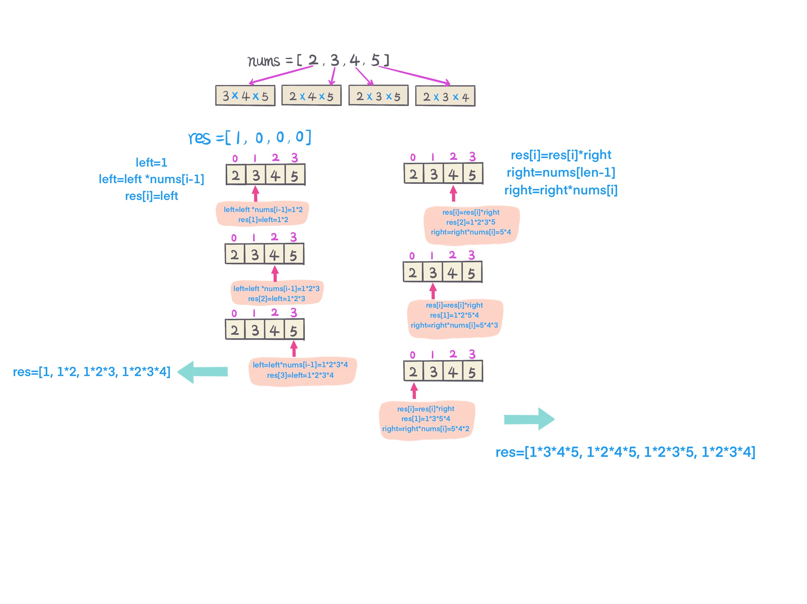

## Problem
[Product of Array Except Self](https://leetcode.com/explore/challenge/card/30-day-leetcoding-challenge/530/week-3/3300/)

## Problem Description
```
Given an array nums of n integers where n > 1,  return an array output such that output[i] is equal to the product of all the elements of nums except nums[i].

Example:

Input:  [1,2,3,4]
Output: [24,12,8,6]
Constraint: It's guaranteed that the product of the elements of any prefix or suffix of the array (including the whole array) fits in a 32 bit integer.

Note: Please solve it without division and in O(n).

Follow up:
Could you solve it with constant space complexity? (The output array does not count as extra space for the purpose of space complexity analysis.)
```

## Solution
Intuitive solution is to product the whole array, result is to divide itself. Notice from problem, without division and 
solve it in `O(n)`.

Idea is to product from left to right, then right to left:

1. Init `res[len]`, res[0] = 1, left = 1;
2. Scan array from left to right, skip the last number, from 
`index = 1, left = left * nums[index -1], res[index] = left;`
3. init right = nums[len - 1], from second right most element, from 
`index = len - 2, res[index] = res[index] * right, right = nums[index] * right`
4. return res.

For example: 
 


####Complexity Analysis

**Time Complexity:** `O(N)`

**Space Complexity:** `O(N)`

- N - the length of array nums

#### Code

```java
class Solution {
    public int[] productExceptSelf(int[] nums) {
        int len = nums.length;
        int[] res = new int[len];
        res[0] = 1;
        // from left to right
        for (int i = 1; i < len; i++) {
            res[i] = res[i - 1] * nums[i - 1];
        }
        // from right to left
        int right = nums[len - 1];
        for (int i = len - 2; i >= 0; i--) {
            res[i] *= right;
            right *= nums[i];
        }
        return res;
    }
}
```
