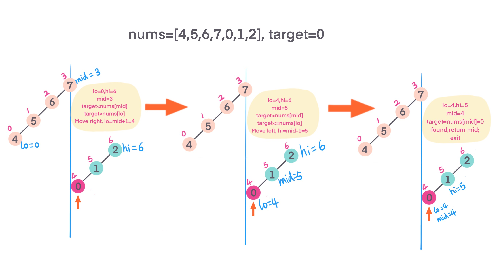

## Problem
[Search in Rotated Sorted Array](https://leetcode.com/explore/challenge/card/30-day-leetcoding-challenge/530/week-3/3304/)

## Problem Description
```
Suppose an array sorted in ascending order is rotated at some pivot unknown to you beforehand.

(i.e., [0,1,2,4,5,6,7] might become [4,5,6,7,0,1,2]).

You are given a target value to search. If found in the array return its index, otherwise return -1.

You may assume no duplicate exists in the array.

Your algorithm's runtime complexity must be in the order of O(log n).

Example 1:

Input: nums = [4,5,6,7,0,1,2], target = 0
Output: 4
Example 2:

Input: nums = [4,5,6,7,0,1,2], target = 3
Output: -1
```

## Solution
This problem asked to implement in `O(logn)`. Binary search should come into your mind when you see `O(logn)`, sorted and search keywords. 

1. Intuitive solution is simple, iterate through array, find target in nums return pos, not, return -1, `O(n)`
2. Binary search, given array is rotated sorted array, meaning there are 2 sorted array. when do binary search, need to carefully compare 
target and nums[mid] and nums[lo] to chose whether go right (higher) or left (lower).
    - define `lo, hi, and mid = (lo + hi)/2`.
    - if `target == nums[mid]` found, return mid and exit.
    - if `nums[mid] >= nums[lo]` meaning mid is within sorted parts, now compare target,
        - if `target >= nums[lo] && target <= nums[md]`, target is located in `[lo, mid]` sorted part, search left, `hi = mid - 1`
        - else target located in `[mid, hi]`, search right, `lo = mid + 1`
    - else check compare target with hi and mid value
        - if `target >= nums[mid] && target <= nums[hi]`, target is located in `[mid, hi]` part, search right, `lo = mid + 1`
        else target located in `[lo, mid]` part, search left, `hi = mid - 1`


For example: 
 



####Complexity Analysis

**Time Complexity:** `O(log(N))`

**Space Complexity:** `O(1)`

- N - the length of array nums

#### Code - Binary search

```java
class Solution {
    public int search(int[] nums, int target) {
        if (nums == null || nums.length == 0) {
            return -1;
        }
        int lo = 0;
        int hi = nums.length - 1;
        while (lo < hi) {
            int mid = lo + (hi - lo) / 2;
            // found, return mid, exit
            if (nums[mid] == target) {
                return mid;
            }
            // mid is within sorted parts
            if (nums[lo] <= nums[mid]) {
                // target located at [lo, mid] part, search left
                if (target >= nums[lo] && target <= nums[mid]) {
                    hi = mid - 1;
                } else {
                    lo = mid + 1;
                }
            } else {
                // target located at [mid, hi] part, search right
                if (target >= nums[mid] && target <= nums[hi]) {
                    lo = mid + 1;
                } else {
                    hi = mid - 1;
                }
            }
        }
        return nums[lo] == target ? lo : -1;
    }
}
```

**Naive solution - O(n)**

```java
class Solution {
    public int search(int[] nums, int target) {
        if (nums == null || nums.length == 0) return -1;
        for (int i = 0; i < nums.length; i++) {
            if (nums[i] == target) return i;
        }
        return -1;
    }
}
```
