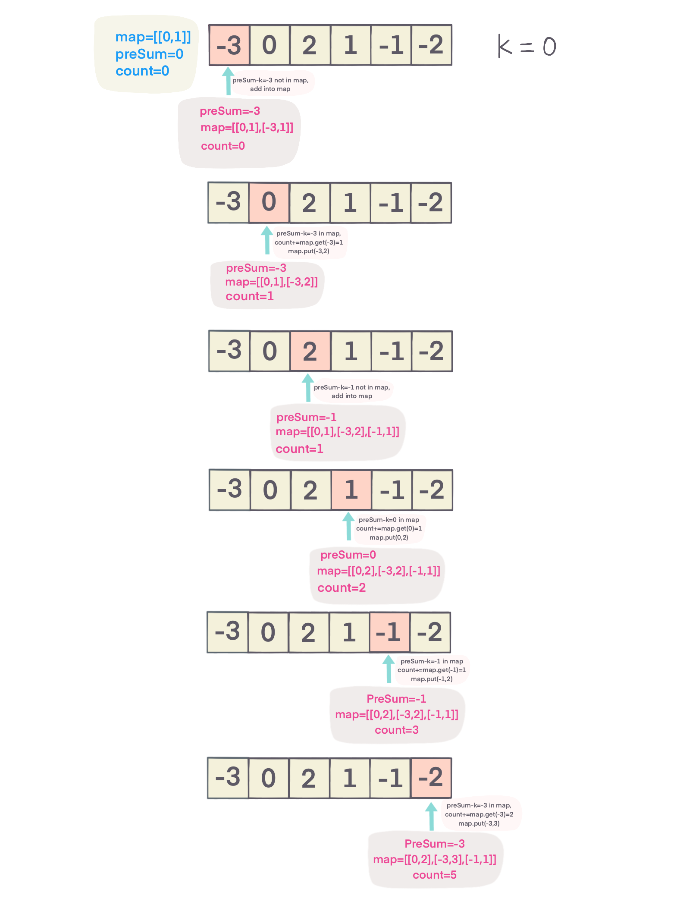

## Problem
[Subarray Sum Equals K](https://leetcode.com/explore/challenge/card/30-day-leetcoding-challenge/531/week-4/3307/)

## Problem Description
```
Given an array of integers and an integer k, you need to find the total number of continuous subarrays whose sum equals to k.

Example 1:

Input:nums = [1,1,1], k = 2
Output: 2
Note:

The length of the array is in range [1, 20,000].
The range of numbers in the array is [-1000, 1000] and the range of the integer k is [-1e7, 1e7].
```

## Solution
Usually when see subarray sum relate problem, preSum should come to your mind. calculate all subarray sum = k, using map to keep track
of number of times presum already appear, for each presum, check whether presum - k in map or not:
- if `map.containsKey(presum - k)`, meaning presum already appear before, `count+=map.get(presum-k);`
- then add/update map, `map.put(presum, map.getOrDefault(presum, 0) + 1)`

after sum the whole array, return count.

For example: 



####Complexity Analysis

**Time Complexity:** `O(N)`

**Space Complexity:** `O(N)`

- N - the length of array nums

#### Code

```java
class Solution {
    public int subarraySum(int[] nums, int k) {
        int count = 0;
        int preSum = 0;
        Map<Integer, Integer> map = new HashMap<>();
        map.put(0, 1);
        for (int num : nums) {
            preSum += num;
            if (map.containsKey(preSum - k)) {
                count += map.get(preSum- k);
            }
            map.put(preSum, map.getOrDefault(preSum, 0) + 1);
        }
        return count;
    }
}
```
