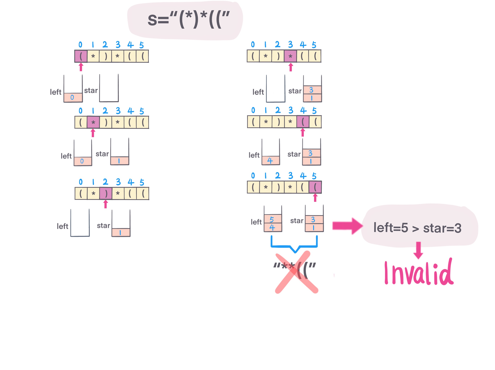

## Problem
[Valid Parenthesis String](https://leetcode.com/explore/challenge/card/30-day-leetcoding-challenge/530/week-3/3301/)

## Problem Description
```
Given a string containing only three types of characters: '(', ')' and '*', write a function to check whether this string is valid. We define the validity of a string by these rules:

Any left parenthesis '(' must have a corresponding right parenthesis ')'.
Any right parenthesis ')' must have a corresponding left parenthesis '('.
Left parenthesis '(' must go before the corresponding right parenthesis ')'.
'*' could be treated as a single right parenthesis ')' or a single left parenthesis '(' or an empty string.
An empty string is also valid.
Example 1:

Input: "()"
Output: True
Example 2:

Input: "(*)"
Output: True
Example 3:

Input: "(*))"
Output: True
Note:

The string size will be in the range [1, 100].
```

## Solution
For valid parenthesis problem, left parenthesis must equal to right parenthesis, and left must be before right parenthesis.

in this problem, add one more character `*`, can be left parenthesis, or empty, or right parenthesis. 

Need to consider one case, that all `)` have matches, and only `(` and `*` position, for example, `"**((*"` invalid, `*` position is in the left of `(`.

1. Record `(` (left) and `*` (star) counts and index.
2. when encounter `)`, check `(` and `*` counts, 
    - if `left.count == 0 && star.count == 0`, means current `)` is left most parenthesis,
    nothing matches, return false;
    - if `left.count > 0`, then left.count--;
    - if `left.count == 0`, then star.count--;
3. when encounter `(`, add left.count++, left.index=i (current index).
4. when encounter `*`, add star.count++, star.index=i (current index).
5. after iterate through String `s`, check
    - if left.count > star.count, return false. (no enough `*` to match `(`).
    - iterate `(`, if left.index > star.index, return false (`*` in left of `(`, not match, i.e. "*("))
    - after compare all `(` and `*` index, return true
6. return true.


For example: 



####Complexity Analysis

**Time Complexity:** `O(N)`

**Space Complexity:** `O(N)`

- N - the length of String s

#### Code

```java
// iterative solution
class Solution {
    public boolean checkValidString(String s) {
        // keep track of `*` index
        Stack<Index> stars = new Stack<>();
        // keep track of `(` index
        Stack<Index> left = new Stack<>();
        int len = s.length();
        for (int i = 0; i < len; i++) {
            char ch = s.charAt(i);
            if (ch == ')') {
                if (stars.isEmpty() && left.isEmpty()) return false;
                // left.count > 0, left.count--
                if (left.size() > 0) left.pop(); 
                else {
                    // star.count > 0, star.count--
                    stars.pop();
                }
            } else if (ch == '*') {
                stars.push(new Index(i));
            } else {
                left.push(new Index(i));
            }
        }
        if (left.size() > stars.size()) return false;
        while (!left.isEmpty()) {
            if (left.pop().index > stars.pop().index) return false;
        }
        return true;
    }
    class Index {
        int index;
        public Index(int index) {
            this.index = index;
        }
    }
}

// recursive solution
class Solution {
    public boolean checkValidString(String s) {
        return helper(s, 0, 0);
    }
    
    private boolean helper(String s, int index, int count) {
        if (index == s.length()) {
            return count == 0;
        }
        if (count < 0) return false;
        char curr = s.charAt(index);
        if (curr == '(') {
            return helper(s, index + 1, count + 1);
        } else if (curr == ')') {
            return helper(s, index + 1, count - 1);
        } else {
            // if `*`, check 3 cases, `*` as empty char, or `*` as `(`, or `*` as `)`
            return helper(s, index + 1, count)
                || helper(s, index + 1, count + 1)
                || helper(s, index + 1, count -1);
        }
    }
}
```
                                                                                                                                                                                                                                                                                                                                                                                                                                                                                                                                                                                                                                                                                                                                                                                                                                                                                                                                                                                                                                                                                                                                                                                                                                            