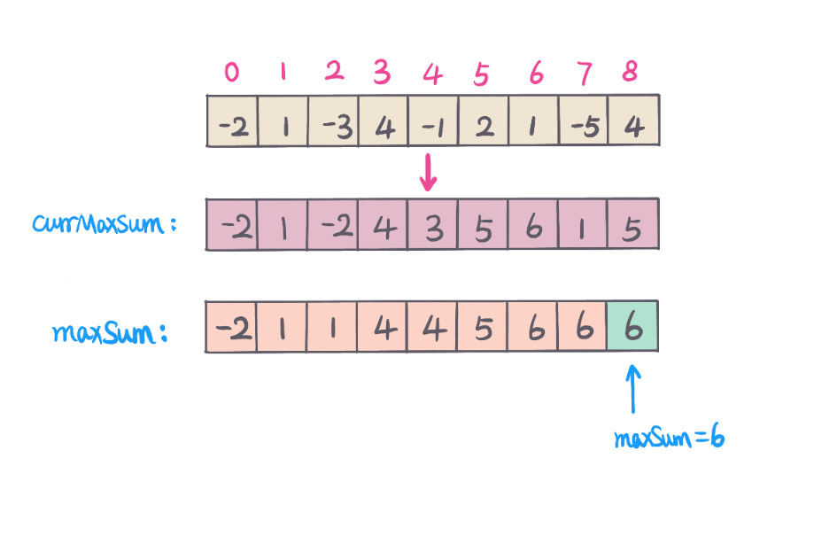

## 题目地址
https://leetcode.com/problems/maximum-subarray/

## 题目描述
```
Given an integer array nums, find the contiguous subarray (containing at least one number) which has the largest sum and return its sum.

Example:

Input: [-2,1,-3,4,-1,2,1,-5,4],
Output: 6
Explanation: [4,-1,2,1] has the largest sum = 6.
Follow up:

If you have figured out the O(n) solution, try coding another solution using the divide and conquer approach, which is more subtle.
```

## 思路

这道题求解连续最大子序列和，以下从时间复杂度角度分析不同的解题思路。

#### 解法一 - 暴力解 （暴力出奇迹， 噢耶！）
一般情况下，先从暴力解分析，然后再进行一步步的优化。

**原始暴力解：**（超时）

求子序列和，那么我们要知道子序列的首尾位置，然后计算首尾之间的序列和。用2个for循环可以枚举所有子序列的首尾位置。
然后用一个for循环求解序列和。这里时间复杂度太高，`O(n^3)`.

#### 复杂度分析
- *时间复杂度：* `O(n^3) - n 是数组长度`
- *空间复杂度：* `O(1)`

#### 解法一 - 前缀和 + 暴力解
**优化暴力解：** (震惊，居然AC了）

在暴力解的基础上，用前缀和我们可以优化到暴力解`O(n^2)`, 这里以空间换时间。
这里可以使用原数组表示`prefixSum`, 省空间。

求序列和可以用前缀和（`prefixSum`) 来优化，给定子序列的首尾位置`（l, r),`
那么序列和 `subarraySum=prefixSum[r] - prefixSum[l - 1];`
用一个全局变量`maxSum`, 比较每次求解的子序列和，`maxSum = max(maxSum, subarraySum)`.

#### 复杂度分析
- *时间复杂度：* `O(n^2) - n 是数组长度`
- *空间复杂度：* `O(n) - prefixSum 数组空间为n`

>如果用更改原数组表示前缀和数组，空间复杂度降为`O(1)`

但是时间复杂度还是太高，还能不能更优化。答案是可以，可以用分治法.

#### 解法三 - [分治法](https://www.wikiwand.com/zh-hans/%E5%88%86%E6%B2%BB%E6%B3%95)

我们把数组`nums`以中间位置（`m`)分为左（`left`)右(`right`)两部分. 那么有，
`left = nums[0]...nums[m - 1]` 和 `right = nums[m + 1]...nums[n-1]`

最大子序列和的位置有以下三种情况：
1. 考虑中间元素`nums[m]`, 跨越左右两部分，这里从中间元素开始，往左求出后缀最大，往右求出前缀最大, 保持连续性。
2. 不考虑中间元素，最大子序列和出现在左半部分，递归求解左边部分最大子序列和
3. 不考虑中间元素，最大子序列和出现在右半部分，递归求解右边部分最大子序列和

分别求出三种情况下最大子序列和，三者中最大值即为最大子序列和。

举例说明，如下图：


#### 复杂度分析
- *时间复杂度：* `O(nlogn) - n 是数组长度`
- *空间复杂度：* `O(1)`

#### 解法四 - [动态规划](https://www.wikiwand.com/zh-hans/%E5%8A%A8%E6%80%81%E8%A7%84%E5%88%92)
动态规划的难点在于找到状态转移方程，假设我们求解到当前位置 `i` 最大子序列和，

`dp[i] - 表示到当前位置 i 的最大子序列和`

状态转移方程为：
`dp[i] = max(dp[i - 1] + nums[i], nums[i])` 

初始化：`dp[0] = nums[0]`

从状态转移方程中，我们只关注前一个状态的值，所以不需要开一个数组记录位置所有子序列和，只需要两个变量，

`maxSumEndingCurrIndex - 累计最大和到当前位置i`

`maxSum - 全局最大子序列和`:

- `maxSumEndingCurrIndex = max(maxSumEndingCurrIndex + nums[i], nums[i])`
- `maxSum = max(maxSumEndingCurrIndex, maxSum)`

如图：


#### 复杂度分析
- *时间复杂度:* `O(n) - n 是数组长度` 
- *空间复杂度:* `O(1)` 

## 关键点分析
1. 暴力解，列举所有组合子序列首尾位置的组合，求解最大的子序列和, 优化可以预先处理，得到前缀和
2. 分治法，每次从中间位置把数组分为左右中三部分， 分别求出左右中（这里中是包括中间元素的子序列）最大和。对左右分别深度递归，三者中最大值即为当前最大子序列和。
3. 动态规划，找到状态转移方程，求到当前位置最大和。

## 代码 (`Java/Python3`)
*Java code* - **前缀和+暴力解**
```java
class MaximumSubarrayPrefixSum {
  public int maximumSubarr(int[] nums) {
      int len = nums.length;
      int[] prefixSum = new int[len + 1];
      // calculate prefixsum
      for (int i = 1; i <= len; i++) {
        prefixSum[i] = prefixSum[i-1] + nums[i - 1];
      }
      int maxSum = nums[0];
      // subarray range [l,r]
      int sum = 0;
      for (int l = 1; l <= len; l++) {
        for (int r = l; r <= len; r++) {
          sum = l == r ? nums[l - 1] : (prefixSum[r] - prefixSum[l - 1]);
          maxSum = Math.max(maxSum, sum);
        }
      }
      return maxSum;
    }
}
```

**Java code** - **分治法**
```java
class MaximumSubarrayDivideConquer {
  public int maxSubArrayDividConquer(int[] nums) {
      if (nums == null || nums.length == 0) return 0;
      return helper(nums, 0, nums.length - 1);
    }
    private int helper(int[] nums, int l, int r) {
      if (l > r) return Integer.MIN_VALUE;
      int mid = (l + r) >>> 1;
      int left = helper(nums, l, mid - 1);
      int right = helper(nums, mid + 1, r);
      int leftMaxSum = 0;
      int sum = 0;
      // left surfix maxSum start from index mid - 1 to l
      for (int i = mid - 1; i >= l; i--) {
        sum += nums[i];
        leftMaxSum = Math.max(leftMaxSum, sum);
      }
      int rightMaxSum = 0;
      sum = 0;
      // right prefix maxSum start from index mid + 1 to r
      for (int i = mid + 1; i <= r; i++) {
        sum += nums[i];
        rightMaxSum = Math.max(sum, rightMaxSum);
      }
      // max(left, right, crossSum)
      return Math.max(leftMaxSum + rightMaxSum + nums[mid], Math.max(left, right));
    }
}
```

**Pyth3on code** - **分治法**

```python
import sys
class Solution:
    def maxSubArray(self, nums: List[int]) -> int:
        return self.helper(nums, 0, len(nums) - 1)
    def helper(self, nums, l, r):
        if l > r:
            return -sys.maxsize
        mid = (l + r) // 2
        left = self.helper(nums, l, mid - 1)
        right = self.helper(nums, mid + 1, r)
        left_suffix_max_sum = right_prefix_max_sum = 0
        sum = 0
        for i in reversed(range(l, mid)):
            sum += nums[i]
            left_suffix_max_sum = max(left_suffix_max_sum, sum)
        sum = 0
        for i in range(mid + 1, r + 1):
            sum += nums[i]
            right_prefix_max_sum = max(right_prefix_max_sum, sum)
        cross_max_sum = left_suffix_max_sum + right_prefix_max_sum + nums[mid]
        return max(cross_max_sum, left, right)
```

 **Java code** - **动态规划**
 ```java
class MaximumSubarrayDP {
   public int maxSubArray(int[] nums) {
     int maxSumEndingCurrIndex = nums[0];
     int maxSum = nums[0];
     for (int i = 1; i < nums.length; i++) {
       maxSumEndingCurrIndex = Math.max(maxSumEndingCurrIndex + nums[i], nums[i]);
       maxSum = Math.max(maxSum, maxSumEndingCurrIndex);
     }
     return maxSum;
  }
}
```
***Python3 code* - **动态规划**
```python
class Solution:
    def maxSubArray(self, nums: List[int]) -> int:
        n = len(nums)
        max_sum_ending_curr_index = max_sum = nums[0]
        for i in range(1, n):
            max_sum_ending_curr_index = max(max_sum_ending_curr_index + nums[i], nums[i])
            max_sum = max(max_sum_ending_curr_index, max_sum)
            
        return max_sum
```

## 扩展
- 如果数组是二维数组，求最大子数组的和？
- 如果要求最大子序列的乘积（相似题中）？

## 相似题
- [Maximum Product Subarray](https://leetcode.com/problems/maximum-product-subarray/)
- [Longest Turbulent Subarray](https://leetcode.com/problems/longest-turbulent-subarray/)
