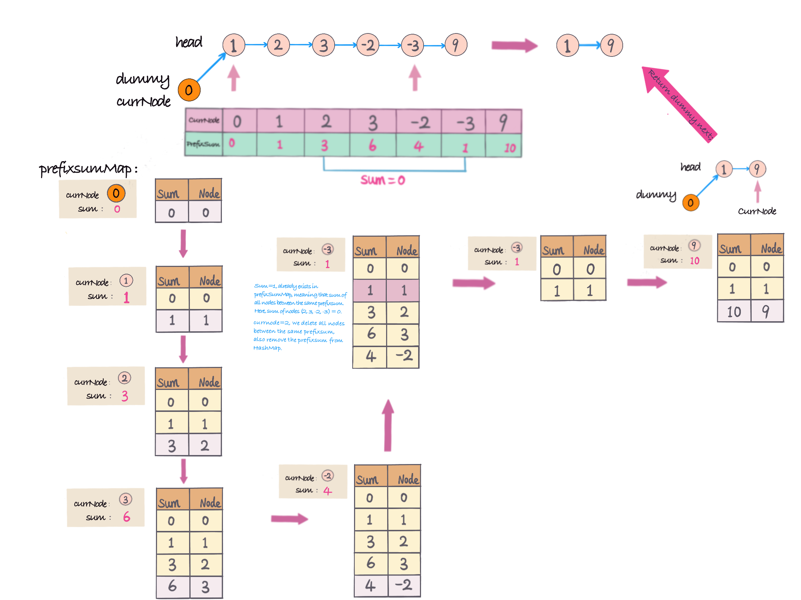

## Problem
https://leetcode.com/problems/remove-zero-sum-consecutive-nodes-from-linked-list/

## Problem Description
```
Given the head of a linked list, we repeatedly delete consecutive sequences of nodes that sum to 0 until there are no such sequences.
   
After doing so, return the head of the final linked list.  You may return any such answer.

(Note that in the examples below, all sequences are serializations of ListNode objects.)

Example 1:

Input: head = [1,2,-3,3,1]
Output: [3,1]
Note: The answer [1,2,1] would also be accepted.
Example 2:

Input: head = [1,2,3,-3,4]
Output: [1,2,4]
Example 3:

Input: head = [1,2,3,-3,-2]
Output: [1]

Constraints:

The given linked list will contain between 1 and 1000 nodes.
Each node in the linked list has -1000 <= node.val <= 1000.

```

## Solution
This problem is typical prefixSum problem, if prefixSum seen, then all elements between two same prefixSum sum = 0.

Here, we can use `HashMap`， `key` as prefixSum, `value` as current Node, if prefixSum already seen in `HashMap`, then delete all nodes between two same prefixSum.
and also delete relative prefixSum in `HashMap`. (We already removed nodes from `head`, so that remove cumulative sum with those nodes. otherwise, it is incorrect.) 

Here, we use `dummy node, ListNode(0)`, (as shown in below pic), as initiating `HashMap`, `put(0, ListNode(0))` into `HashMap`, iterate `ListNode`，
- if `prefixSum in HashMap`, delete all nodes
- if `prefixSum not in HashMap`, put prefixSum and currNode into `HashMap`. `map.put(prefixSum, currNode)`.

举例：`head = [1, 2, 3, -2, -3, 9]`



#### Complexity Analysis
- *Time Complexity:* `O(n) - n is number of ListNode`
- *Space Complexity:* `O(n) - HashMap`

## Key Points
- calculate prefixSum
- use `HashMap` keep track all prefixSum and currNode.
- Initialize `HashMap`，put`0` （here use`dummy node `）
- Delete all Nodes between two same prefixSum, delete related prefixSum from HashMap.
- return `dummy.next;`.

## Code (`Java/Python3`)
*Java Code*
```java
class RemoveZeroInLinkedList {
  public static ListNode removeZeroSumSublists(ListNode head) {
      ListNode dummy = new ListNode(0);
      ListNode currNode = dummy;
      dummy.next = head;
      int prefixSum = 0;
      Map<Integer, ListNode> prefixSumMap = new HashMap<>();
      while (currNode != null) {
        prefixSum += currNode.val;
        // seen prefixSum in HashMap, remove all nodes and relative prefixSum from HashMap
        if (prefixSumMap.containsKey(prefixSum)) {
          currNode = prefixSumMap.get(prefixSum).next;
          int sum = prefixSum + currNode.val;
          while (sum != prefixSum) {
            prefixSumMap.remove(sum);
            currNode = currNode.next;
            sum += currNode.val;
          }
          prefixSumMap.get(prefixSum).next = currNode.next;
        } else {
          // prefixSum not seen in HashMap, add into HashMap
          prefixSumMap.put(prefixSum, currNode);
        }
        currNode = currNode.next;
      }
      return dummy.next;
  }
}
```
*Python3 code*
```python
# Definition for singly-linked list.
# class ListNode:
#     def __init__(self, x):
#         self.val = x
#         self.next = None

class Solution:
    def removeZeroSumSublists(self, head: ListNode) -> ListNode:
        dummy = curr_node = ListNode(0)
        dummy.next = head
        prefix_sum = 0
        prefix_sum_map = {}
        while curr_node:
            prefix_sum += curr_node.val
            if prefix_sum in prefix_sum_map:
                curr_node = prefix_sum_map.get(prefix_sum).next
                sum = prefix_sum + curr_node.val
                while sum != prefix_sum and sum in prefix_sum_map:
                    del prefix_sum_map[sum]
                    curr_node = curr_node.next
                    sum += curr_node.val
                prefix_sum_map[prefix_sum].next = curr_node.next
            else:
                prefix_sum_map[prefix_sum] = curr_node
            curr_node = curr_node.next
        return dummy.next
```
