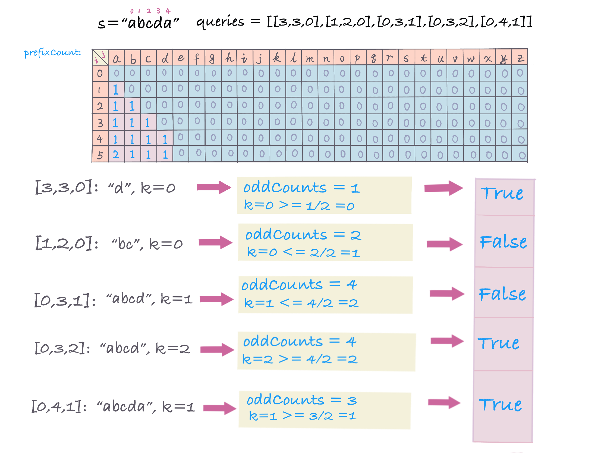
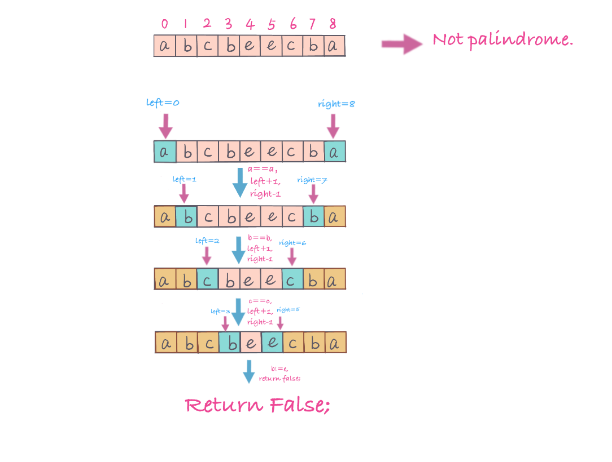

## Problem
https://leetcode.com/problems/can-make-palindrome-from-substring/

## Problem Description
```
Given a string s, we make queries on substrings of s.

For each query queries[i] = [left, right, k], we may rearrange the substring s[left], ..., s[right], and then choose up to k of them to replace with any lowercase English letter. 

If the substring is possible to be a palindrome string after the operations above, the result of the query is true. Otherwise, the result is false.

Return an array answer[], where answer[i] is the result of the i-th query queries[i].

Note that: Each letter is counted individually for replacement so if for example s[left..right] = "aaa", and k = 2, we can only replace two of the letters.  (Also, note that the initial string s is never modified by any query.)

Example :

Input: s = "abcda", queries = [[3,3,0],[1,2,0],[0,3,1],[0,3,2],[0,4,1]]
Output: [true,false,false,true,true]
Explanation:
queries[0] : substring = "d", is palidrome.
queries[1] : substring = "bc", is not palidrome.
queries[2] : substring = "abcd", is not palidrome after replacing only 1 character.
queries[3] : substring = "abcd", could be changed to "abba" which is palidrome. Also this can be changed to "baab" first rearrange it "bacd" then replace "cd" with "ab".
queries[4] : substring = "abcda", could be changed to "abcba" which is palidrome.
 
Constraints:

1 <= s.length, queries.length <= 10^5
0 <= queries[i][0] <= queries[i][1] < s.length
0 <= queries[i][2] <= s.length
s only contains lowercase English letters.
```

## 思路
In this problem, there are 2 conditions for checking whether substring is palindrome:

- Rearrange, very useful here.
e.g：`abb` can be rearranged to palindrome string `bab`, itself maybe not palindrome, but after rearrange, can be palindrome.

- Can replace with at most K letters, meaning itself or after rearrange itself still cannot become palindrome, it may be palindrome after replacing K letters.
e.g: `abcd, k = 2`，can replace`cd -> ba`, to be palindrome`abba`; or replace`ab -> dc`, be palindrome `dccd`。

e.g: `abcd, k = 1`，then no matter how to replace, it cannot become palindrome.

After analysis, found there is some pattern to form palindrome by rearranging and replace K letters. 

If we calculate the number of letters, and track the odd number letters, as `oddCounts`, if `oddCounts/2 >= K` then we can through replace K letters to form a new palindrome string, otherwise false.

Then this problem becomes to calculate the number of the letter which appears odd times in a substring, queries give us range, so range prefix sum is useful in this case (so that for each given range, we can get the number in `~O(1)` time).

Steps:

1. Define prefix sum matrix: `prefixCount[i][j]` keep track of in string `s`, in range `[0, i]` aka, in `s[0,i]`, the number of letter `j`.

2. Count the number of letters which appears odd number times (`oddCounts`) in range `[start, end]`. 
`oddCounts += prefixCount[end+1][currChar] - prefixcount[start][currChar]` 。

3. If `oddCounts/2 >= K`, then substring can become palindrome after rearrange and replace `<=K `letters. 

4. If `oddCounts/2 < K`, then substring cannot become palindrome, `return false;`.

As below pic, create a prefix sum matrix, `prefixCount[i][j]`, since string only contains 26 lowercase letters, it is `O(1)` for loop 26 letters.


 

#### Complexity Analysis
- *Time Complexity:* `O(m * 26) - m is queries length`
- *Space Complexity:* `O(n * 26) - n is s length, n * 26 prefixcount matrix`

>**Note**, here we can also use HashMap，so that we don't need to loop 26 letters each time, only loop the number of letters in substring.


**Validate a String is Palindrome**：

Palindrome String: forward and backward are exactly the same, e.g: `madam，noon, 12321， aaaa` etc.

Validate Palindrome Solution:

1. **Solution #1:** Reverse string s, then check whether original string equals to reversed string. `return s == reverse(s)` 

2. **Solution #2:** use left and right two pointers, `（left， right）`，`left` start from index `0`, `right` from last index，when `（left < right)`, compare

    -`s[left]` == ` s[right]`, then continue next, `left move right, left++`, `right move left, right--` 

    - `s[left]` != ` s[right]`，then `return false`。
    
  
  
```java
class ValidPalindrome {
  public boolean isPalindrome(String s) {
    if (s == null || s.length() < 2) return true;
    int left = 0;
    int right = s.length() - 1;
    while (left < right) {
      if (s.charAt(left) != s.charAt(right)) return false;
      left++;
      right--;
    }
    return true;
  }
}
```

## Key Points

- prefix sum matrix count index from 0 to i substring, the number of times that `j` letter appears
- For each query, count the number of letters which appears odd times (`oddCounts`) in range `[start, end]`, then compare `oddCounts ` and `k`

## Code (`Java/Python3`)
*Java code*
```java
public class CanMakePalindromeFromSubstring {
  public List<Boolean> canMakePaliQueries(String s, int[][] queries) {
    int n = s.length();
    int[][] prefixCount = new int[n + 1][26];
    // prefixCount[i][j] matrix, calculate number of letter from range [0,i] for j letter.
    for (int i = 0; i < n; i++) {
      prefixCount[i + 1] = prefixCount[i].clone();
      prefixCount[i + 1][s.charAt(i) - 'a']++;
    }
    List<Boolean> res = new ArrayList<>();
    for (int[] q : queries) {
      int start = q[0];
      int end = q[1];
      int k = q[2];
      int count = 0;
      // count odd letters number from range [start, end]
      for (int i = 0; i < 26; i++) {
        count += (prefixCount[end + 1][i] - prefixCount[start][i]) % 2;
      }
      res.add(count / 2 <= k);
    }
    return res;
  }
}
```

*Python3 code* (slow :( )
```python
class Solution:
    def canMakePaliQueries(self, s: str, queries: List[List[int]]) -> List[bool]:
        prefix_sum = [[0] * 26]
        for i, char in enumerate(s):
            prefix_sum.append(prefix_sum[i][:])
            prefix_sum[i + 1][ord(char) - ord('a')] += 1
        res = [True] * len(queries)
        for i, (start, end, k) in enumerate(queries):
            odd_count = 0
            for j in range(26):
                odd_count += (prefix_sum[end + 1][j] - prefix_sum[start][j]) % 2
            res[i] = (odd_count // 2 <= k)
        return res
```
