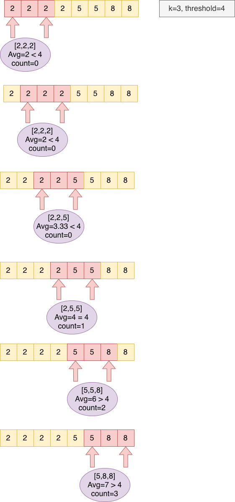

## Problem
[1343. Number of Sub-arrays of Size K and Average Greater than or Equal to Threshold](https://leetcode.com/contest/biweekly-contest-19/problems/number-of-sub-arrays-of-size-k-and-average-greater-than-or-equal-to-threshold/)

## Problem Description
```
Given an array of integers arr and two integers k and threshold.

Return the number of sub-arrays of size k and average greater than or equal to threshold.

 Example 1:

 Input: arr = [2,2,2,2,5,5,5,8], k = 3, threshold = 4
 Output: 3
 Explanation: Sub-arrays [2,5,5],[5,5,5] and [5,5,8] have averages 4, 5 and 6 respectively. All other sub-arrays of size 3 have averages less than 4 (the threshold).

 Example 2:

 Input: arr = [1,1,1,1,1], k = 1, threshold = 0
 Output: 5
 
 Example 3:

 Input: arr = [11,13,17,23,29,31,7,5,2,3], k = 3, threshold = 5
 Output: 6
 Explanation: The first 6 sub-arrays of size 3 have averages greater than 5. Note that averages are not integers.

 Example 4:

 Input: arr = [7,7,7,7,7,7,7], k = 7, threshold = 7
 Output: 1
 
 Example 5:

 Input: arr = [4,4,4,4], k = 4, threshold = 1
 Output: 1
  
Constraints:

  1 <= arr.length <= 10^5
  1 <= arr[i] <= 10^4
  1 <= k <= arr.length
  0 <= threshold <= 10^4
```

## Solution
This problem is pretty straigtforward, group each size k subarray, calculate avg of this group, compare avg and threshold.

Steps:
- check whether current length of arr and size k
    - if len < k, return false. not enough elements to from a group subarray of size k.
- scan arr from start position 0, each time check group a subarray of size k.
    - calculate avg of subarray of current size k [i, i + k -1], 
    - if avg >= threshold, count + 1
    - otherwise, do nothing, continue, index i+1;
- until last pos (len - k). return count. 


For example: 



#### Complexity Analysis
- *Time Complexity:* `O(n) - n is the length of arr`
- *Space Complexity:* `O(1) - no extra space`


## Key Points

- Group each size k subarray. 
- Calculate avg of subarray of size k, compare with threshold
- Count increase 1 if meet requirements

## Code
*Java Code*
```java
class Solution {
    public int numOfSubarrays(int[] arr, int k, int threshold) {
        // check len whether can form subarray of size k
        if (arr.length < k) return 0;
        int count = 0;
        int len = arr.length;
        for (int i = 0; i <= len - k; i++) {
            // if meet size of k subarray and avg >= threshold, count+1
            if (isAvgGreat(arr, i, i + k - 1, threshold)) {
                count++;
            }
        }
        return count;
    }

    private boolean isAvgGreat(int[] arr, int i, int j, int threshold) {
        long sum = 0;
        for (int k = i; k <= j; k++) {
            sum += arr[k];
        }
        return (sum / (j - i + 1)) >= threshold;
    } 
}
```

