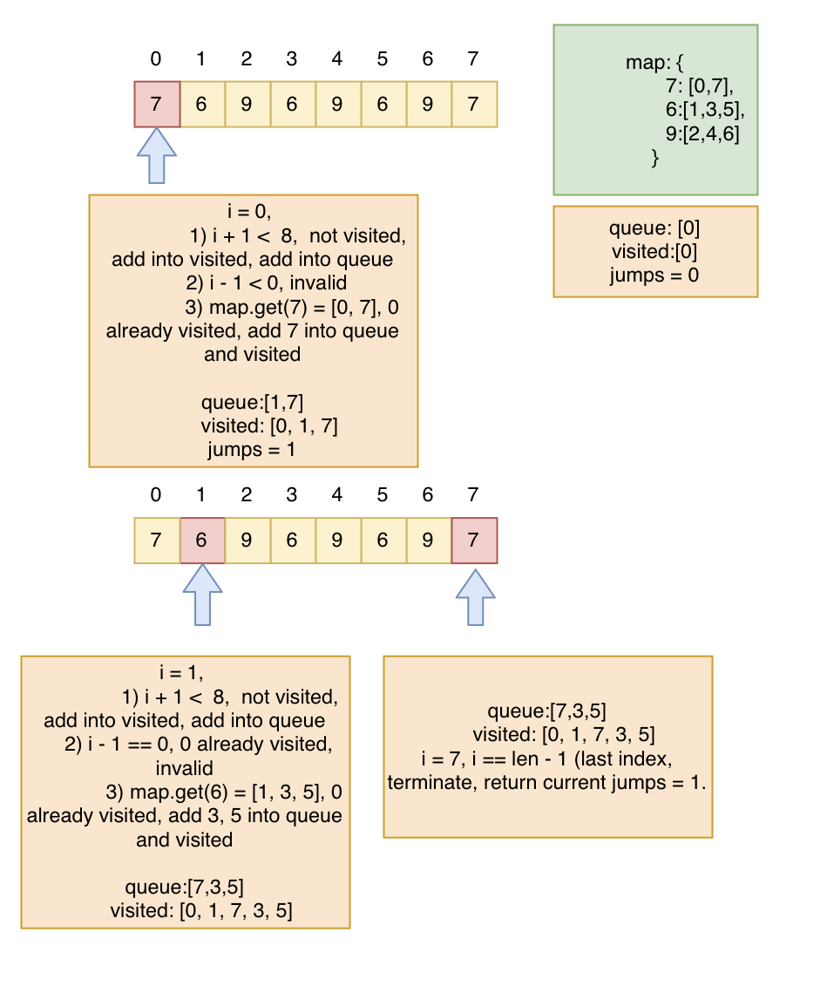

## Problem
[1345. Jump Game IV](https://leetcode.com/contest/biweekly-contest-19/problems/jump-game-iv/)

## Problem Description
```
 Given an array of integers arr, you are initially positioned at the first index of the array.

 In one step you can jump from index i to index:

    - i + 1 where: i + 1 < arr.length.
    - i - 1 where: i - 1 >= 0.
    - j where: arr[i] == arr[j] and i != j.
 Return the minimum number of steps to reach the last index of the array.

 Notice that you can not jump outside of the array at any time.
  

  Example 1:

  Input: arr = [100,-23,-23,404,100,23,23,23,3,404]
  Output: 3
  Explanation: You need three jumps from index 0 --> 4 --> 3 --> 9. Note that index 9 is the last index of the array.

  Example 2:

  Input: arr = [7]
  Output: 0
  Explanation: Start index is the last index. You don't need to jump.

  Example 3:

  Input: arr = [7,6,9,6,9,6,9,7]
  Output: 1
  Explanation: You can jump directly from index 0 to index 7 which is last index of the array.
  
  Example 4:

  Input: arr = [6,1,9]
  Output: 2

  Example 5:

  Input: arr = [11,22,7,7,7,7,7,7,7,22,13]
  Output: 3
   

 Constraints:

  - 1 <= arr.length <= 5 * 10^4
  - -10^8 <= arr[i] <= 10^8
```

## Solution
This problem can use BFS to check, check each level, if already found in last index, then return, after each level, jumps+1. here level means 3 possible options to jump. so that we can find the min jump steps.

ways to jump from index `i`: 
1. i + 1, if i + 1 < len && `i + 1` index not visited before 
2. `i - 1`, if `i - 1 >= 0` && `i - 1` index not visited before.
3. different indexes which has the same value as value in index `i`.

Idea is to using Map to store element and corresponding indexes as key, value pair.

Queue to store each level indexes can jumped into from index `i`:
- first check curr index `i == len - 1 (last index)`
    - if yes, terminate process, return jumps.
    - if not, continue
- add `i + 1` if meet requirement, and mark as visited. 
- add `i - 1` if meet requirement, and mark as visited
- add `map.get(arr[i])` -- the list of indexes if meet requirement, and mark visited. since it is already visited all indexes, then remove current element from map to avoid unnecessary visit. 
- after each level, jumps+1

For example: 



#### Complexity Analysis
- *Time Complexity:* `O(n)`
- *Space Complexity:* `O(n)`

`n - n is length of arr`

## Key Points

- Group each size k subarray. 
- Calculate avg of subarray of size k, compare with threshold
- Count increase 1 if meet requirements

## Code
*Java Code*
```java
class Solution {
    public int minJumps(int[] arr) {
        // already last index
        if (arr.length == 1) return 0;
        int jumps = 0;
        int len = arr.length;
        // add all indexes for the same value into map, key as element, value is the list of indexes for the element
        Map<Integer, List<Integer>> map = new HashMap<>();
        for (int i = 0; i < len; i++) {
            map.computerIfAbsent(arr[i], new ArrayList<>()).add(i);
        }
        // queue to keep index
        Queue<Integer> queue = new LinkedList<>();
        // start from index 0
        queue.offer(0);
        // using HashSet to store already visited index, avoid dup visit
        Set<Integer> visited = new HashSet<>();
        while (!queue.isEmpty()) {
            int size = queue.size();
            while (size-- > 0) {
                int currIdx = queue.poll();
                // already last index, return
                if (currIdx = len - 1) return jumps;
                // check 3 options to jump
                // 1) i + 1, if i + 1 not visited, add into visited, and add into queue
                if (currIdx + 1 < len && visited.add(currIdx + 1)) {
                    queue.offer(currIdx + 1);
                }
                // 2) i - 1, if i - 1 not visited, add into visited and queue
                if (currIdx - 1 >= 0 && visited.add(currIdx - 1)) {
                    queue.offer(currIdx - 1);
                }
                // 3) the same value with different indexes
                if (map.containsKey(arr[currIdx])) {
                    for (int idx : map.get(arr[currIdx])) {
                        if (visited.add(idx)) {
                            queue.offer(idx);
                        }
                    }
                    // already visited, remove from map to avoid dup visit
                    map.remove(arr[curr]);
                }
            }
            // after checking 3 possible ways, jumps + 1
            jumps++;
        }
        return -1;
    }
}
```

