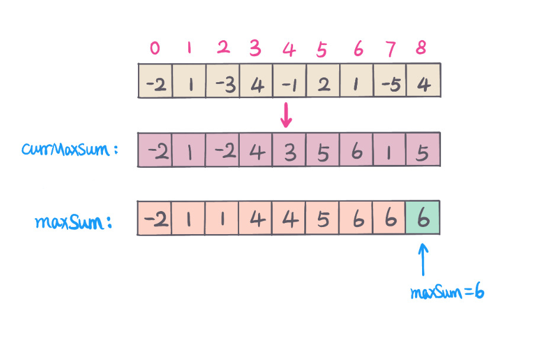

## Problem
https://leetcode.com/problems/maximum-subarray/

## Problem Description
```
Given an integer array nums, find the contiguous subarray (containing at least one number) which has the largest sum and return its sum.

Example:

Input: [-2,1,-3,4,-1,2,1,-5,4],
Output: 6
Explanation: [4,-1,2,1] has the largest sum = 6.
Follow up:

If you have figured out the O(n) solution, try coding another solution using the divide and conquer approach, which is more subtle.
```

## Solution

Below will explain 4 different approaches to solve this problem.

#### Solution #1 - Brute Force
Usually start from brute force when you don't have any idea, then step by step to optimize your solution.
 
**Brute Force：**（TLE）

Subarray sum, we then need to know subarray range [l, r], 2 `for` loop, list all possible subarrays, then 1 `for` loop to calculate current subarray sum, 
using a global variable to keep track `maxSum`. This approach has very bad performance，time complexity is `O(n^3)`.

#### Complexity Analysis
- *Time Complexity:* `O(n^3) - n array length`
- *Space Complexity:* `O(1)`

#### Solution #2 - PrefixSum + Brute Force

**Optimal brute force：** (AC）

With brute force approach, we can precalculate prefixSum, so that no need to calculate subarray sum every time, time complexity can reduce to `O(n^2)`

calculate prefixSum, for giving subarray range `[l,r]`,
current subarray sum: `subarraySum = prefixSum[r] - prefixSum[l - 1];`
global variable `maxSum`, compare every possible subarray sum to record max sum, `maxSum = max(maxSum, subarraySum)`.


#### Complexity Analysis
- *Time Complexity:* `O(n^2) - n array length`
- *Space Complexity:* `O(n) - prefixSum array length n`

>If update original input array to represent prefix sum, then space will reduce to `O(1)`

With this optimization, the time complexity is still too high, can we come up better optimization approach.

yes, Divide and Conquer

#### Solution #3 - [Divide and Conquer](https://www.wikiwand.com/en/Divide-and-conquer_algorithm)

We partition array `nums` into two smaller arrays (`left` and `right`) from middle index `m`,

Then we have two arrays:
- `left = nums[0]...nums[m - 1]`
- `right = nums[m + 1]...nums[n-1]`

The maximum subarray sum can be either one of below three maximum sum: 
1. Consider middle element `nums[m]`, Cross left and right subarray, the maximum sum is sum of 

maximum left array suffix sum - leftMaxSum,  maximum right array prefix sum - rightMaxSum and middle element - nums[m]
-> `crossMaxSum = leftMaxSum + rightMaxSum + nums[m]`

2. Dont' contain middle element `nums[m]`, maxSum is in `left`, left do recursive return max. 
3. Don't contain middle element `nums[m]`, maxSum is in `right`, right do recursive return max.

The maximum sum is `max(left, right, crossMaxSum)`

For example, `nums=[-2,1,-3,4,-1,2,1,-5,4]`


#### Complexity Analysis
- *Time Complexity:* `O(nlogn) - n input array length`
- *Space Complexity:* `O(1)`

#### Solution #4 - [Dynamic Programing](https://www.wikiwand.com/zh-hans/%E5%8A%A8%E6%80%81%E8%A7%84%E5%88%92)
Key points of DP is to find DP formula and initial state. Assume we have maximum subarray sum ending at currrent index`i`, then，

`dp[i] - maximum sum of subarray that ends at index i`

DP formula:
`dp[i] = max(dp[i - 1] + nums[i], nums[i])` 

Initial state：`dp[0] = nums[0]`

From above DP formula, notice only need to access its previous element at each step. In this case, we can use two variables,

`maxSumEndingCurrIndex - maximum sum of subarray that must end with current index i`. 

`maxSum - global maximum subarray sum`

- `maxSumEndingCurrIndex = max(maxSumEndingCurrIndex + nums[i], nums[i]`
- `maxSum = max(maxSumEndingCurrIndex, maxSum)`

As below pic:



#### Complexity Analysis
- *Time Complexity:* `O(n) - n array length`
- *Space Complexity:* `O(1)`


## Key Points
1. Brute force, list all possible subarray, calculate sum for each subarray (use prefixSum to optimize), return max. 
2. Divide and Conquer, from middle index, divide array into left and right part. 
Recursively get left maximum sum and right maximum sum, and include middle element maximum sum. 
`return max(leftMaxSum, rightMaxSum, and crossMaxSum)`.
3. Dynamic Programming, find DP formula and initial state, and identify initial value, return maximum sum subarray。

## Code (`Java/Python3`)
*Java code* - **prefixSum + brute force**
```java
class MaximumSubarrayPrefixSum {
  public int maximumSubarr(int[] nums) {
      int len = nums.length;
      int[] prefixSum = new int[len + 1];
      // calculate prefixsum
      for (int i = 1; i <= len; i++) {
        prefixSum[i] = prefixSum[i-1] + nums[i - 1];
      }
      int maxSum = nums[0];
      // subarray range [l,r]
      int sum = 0;
      for (int l = 1; l <= len; l++) {
        for (int r = l; r <= len; r++) {
          sum = l == r ? nums[l - 1] : (prefixSum[r] - prefixSum[l - 1]);
          maxSum = Math.max(maxSum, sum);
        }
      }
      return maxSum;
    }
}
```

**Java code** - **Divide and Conquer**
```java
class MaximumSubarrayDivideConquer {
  public int maxSubArrayDividConquer(int[] nums) {
      if (nums == null || nums.length == 0) return 0;
      return helper(nums, 0, nums.length - 1);
    }
    private int helper(int[] nums, int l, int r) {
      if (l > r) return Integer.MIN_VALUE;
      int mid = (l + r) >>> 1;
      int left = helper(nums, l, mid - 1);
      int right = helper(nums, mid + 1, r);
      int leftMaxSum = 0;
      int sum = 0;
      // left surfix maxSum start from index mid - 1 to l
      for (int i = mid - 1; i >= l; i--) {
        sum += nums[i];
        leftMaxSum = Math.max(leftMaxSum, sum);
      }
      int rightMaxSum = 0;
      sum = 0;
      // right prefix maxSum start from index mid + 1 to r
      for (int i = mid + 1; i <= r; i++) {
        sum += nums[i];
        rightMaxSum = Math.max(sum, rightMaxSum);
      }
      // max(left, right, crossSum)
      return Math.max(leftMaxSum + rightMaxSum + nums[mid], Math.max(left, right));
    }
}
```

**Pyth3on code** - **Divide and Conquer**

```python
import sys
class Solution:
    def maxSubArray(self, nums: List[int]) -> int:
        return self.helper(nums, 0, len(nums) - 1)
    def helper(self, nums, l, r):
        if l > r:
            return -sys.maxsize
        mid = (l + r) // 2
        left = self.helper(nums, l, mid - 1)
        right = self.helper(nums, mid + 1, r)
        left_suffix_max_sum = right_prefix_max_sum = 0
        sum = 0
        for i in reversed(range(l, mid)):
            sum += nums[i]
            left_suffix_max_sum = max(left_suffix_max_sum, sum)
        sum = 0
        for i in range(mid + 1, r + 1):
            sum += nums[i]
            right_prefix_max_sum = max(right_prefix_max_sum, sum)
        cross_max_sum = left_suffix_max_sum + right_prefix_max_sum + nums[mid]
        return max(cross_max_sum, left, right)
```

 **Java code** - **Dynamic Programming**
 ```java
class MaximumSubarrayDP {
   public int maxSubArray(int[] nums) {
      int maxSumEndingCurrIndex = nums[0];
      int maxSum = nums[0];
      for (int i = 1; i < nums.length; i++) {
        maxSumEndingCurrIndex = Math.max(maxSumEndingCurrIndex + nums[i], nums[i]);
        maxSum = Math.max(maxSum, maxSumEndingCurrIndex);
      }
      return maxSum;
   }
}
```

***Python3 code* - **Dynamic Programming**
```python
class Solution:
    def maxSubArray(self, nums: List[int]) -> int:
        n = len(nums)
        max_sum_ending_curr_index = max_sum = nums[0]
        for i in range(1, n):
            max_sum_ending_curr_index = max(max_sum_ending_curr_index + nums[i], nums[i])
            max_sum = max(max_sum_ending_curr_index, max_sum)
            
        return max_sum
```


## Follow Up
- When given M*N matrix, how to calculate maximum submatrix sum?
- When given array, return maximum product subarray? compare with maximum sum subarray, what is the difference? 

## Similar Questions
- [Maximum Product Subarray](https://leetcode.com/problems/maximum-product-subarray/)
- [Longest Turbulent Subarray](https://leetcode.com/problems/longest-turbulent-subarray/)
