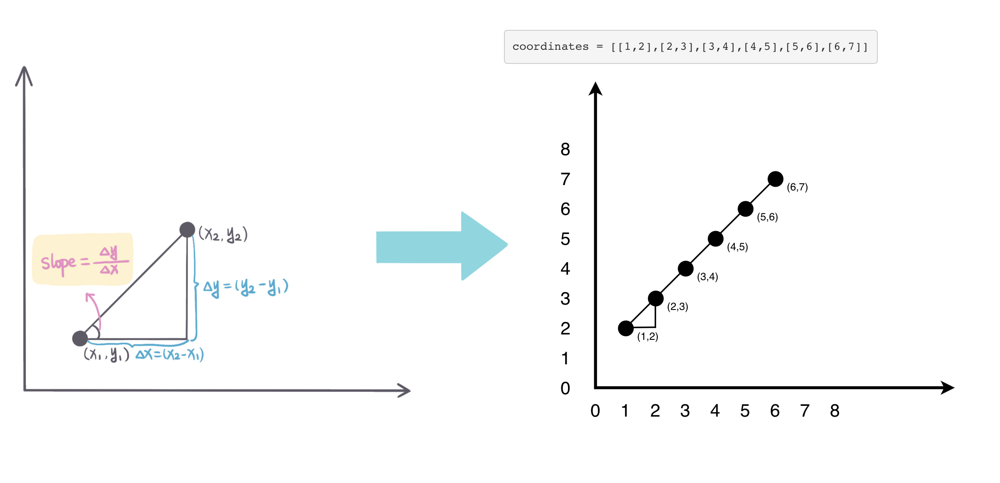

## Problem
[Check If It Is a Straight Line](https://leetcode.com/explore/featured/card/may-leetcoding-challenge/535/week-2-may-8th-may-14th/3323/)

## Problem Description
```
You are given an array coordinates, coordinates[i] = [x, y], where [x, y] represents the coordinate of a point. Check if these points make a straight line in the XY plane.

Example 1:

Input: coordinates = [[1,2],[2,3],[3,4],[4,5],[5,6],[6,7]]
Output: true

Example 2:
Input: coordinates = [[1,1],[2,2],[3,4],[4,5],[5,6],[7,7]]
Output: false
 

 Constraints:

 1. 2 <= coordinates.length <= 1000
 2. coordinates[i].length == 2
 3. -10^4 <= coordinates[i][0], coordinates[i][1] <= 10^4
 4. coordinates contains no duplicate point.
```

## Solution
This problem is a math problem, how to calculate slope for any two points. 

for 2 points: X(x1, y1), Y(x2, y2), `slope = (y1 - y2) / (x1 - x2)`

Then this problem can seen as calculate every two points slope and compare all the slopes. if slopes are the same, then all points are in the same line, otherwise not in the same line. 


For example:



####Complexity Analysis

**Time Complexity:** `O(N)`

**Space Complexity:** `O(N)`

- N - Max (ransom note length, magazine length)

#### Code

```java
class Solution {
    public boolean checkStraightLine(int[][] coordinates) {
        int len = coordinates.length;
        int[] first = coordinates[0];
        int[] second = coordinates[1];
        // calculate slope of first and second points, slope = (y2-y1)/(x2-x1)
        double slope = (double)(first[1] - second[1]) / (first[0] - second[0]);
        // check every two points slope and compare with slope, if not same, then not in a line, terminate, return false.
        for (int i = 2; i < len; i++) {
            in[] curr = coordicates[i];
            if ((double)(first[1] - curr[1]) / (first[0] - curr[0]) != slope) {
                return false;
            }
        }
        // if already check all point, and all have the same slope, in the same line.
        return true;
    }
}
```
