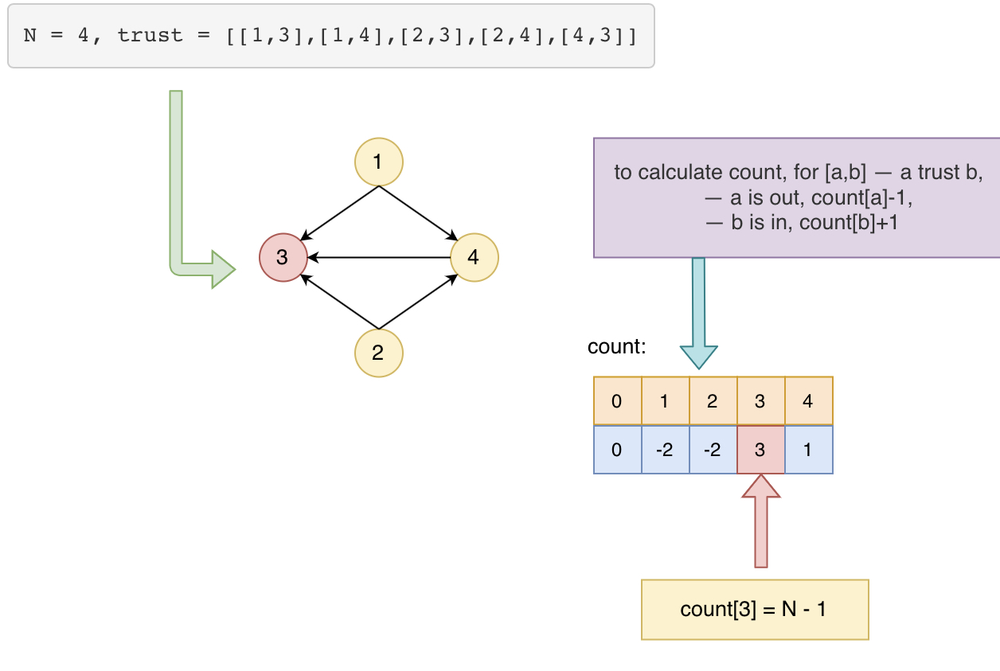

## Problem
[Find Town Judge](https://leetcode.com/explore/featured/card/may-leetcoding-challenge/535/week-2-may-8th-may-14th/3325/)

## Problem Description
```
In a town, there are N people labelled from 1 to N.  There is a rumor that one of these people is secretly the town judge.

If the town judge exists, then:

The town judge trusts nobody.
Everybody (except for the town judge) trusts the town judge.
There is exactly one person that satisfies properties 1 and 2.
You are given trust, an array of pairs trust[i] = [a, b] representing that the person labelled a trusts the person labelled b.

If the town judge exists and can be identified, return the label of the town judge.  Otherwise, return -1.


 Example 1:

 Input: N = 2, trust = [[1,2]]
 Output: 2

 Example 2:

 Input: N = 3, trust = [[1,3],[2,3]]
 Output: 3

 Example 3:

 Input: N = 3, trust = [[1,3],[2,3],[3,1]]
 Output: -1

 Example 4:

 Input: N = 3, trust = [[1,2],[2,3]]
 Output: -1

 Example 5:

 Input: N = 4, trust = [[1,3],[1,4],[2,3],[2,4],[4,3]]
 Output: 3
  

Note:

 1. 1 <= N <= 1000
 2. trust.length <= 10000
 3. trust[i] are all different
 4. trust[i][0] != trust[i][1]
 5. 1 <= trust[i][0], trust[i][1] <= N
```

## Solution
This problem can be seen as a directed graph，from a -> b, a represent a trust b, as below example pic. so that we can calculate based on the degrees. 
- Use a count array -- `count[i] -- the number of people trust people i.`
- for (a,b), a trust b, 
    - count[a]-1
    - count[b]+1 (increase the number of trust people for b)
- after iterate all trust array, iterate count
    - for people i, if count[i]==N-1, meaning has N - 1 people trust i, return i.
    - if not found any count[i]=N-1
    - return -1 (no judge found)


For example:



####Complexity Analysis

**Time Complexity:** `O(N)`

**Space Complexity:** `O(N)`

- N - the number N

#### Code

```java
class Solution {
    public int findJudge(int N, int[][] trust) {
        // count start from 1 to N, [1,N]
        int[] count = new int[N + 1];
        // for (a,b) -- a trust b, when a, count[a]--, count[b]++
        for (int[] t : trust) {
            count[t[0]]--;
            count[t[1]]++;
        }
        // iterate count start from 1, if count[i]==N-1, meaning all people trust i, and i does not trust anyone, return i. judge found. otherwise return -1.
        for (int i = 1; i <= N; i++) {
            if (count[i] == N - 1) return i;
        }
        return -1;
    }
```
