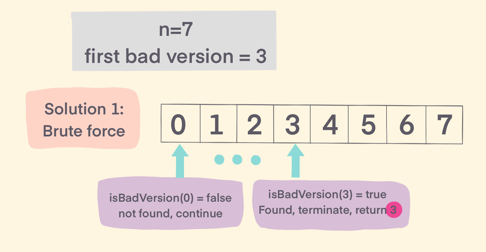
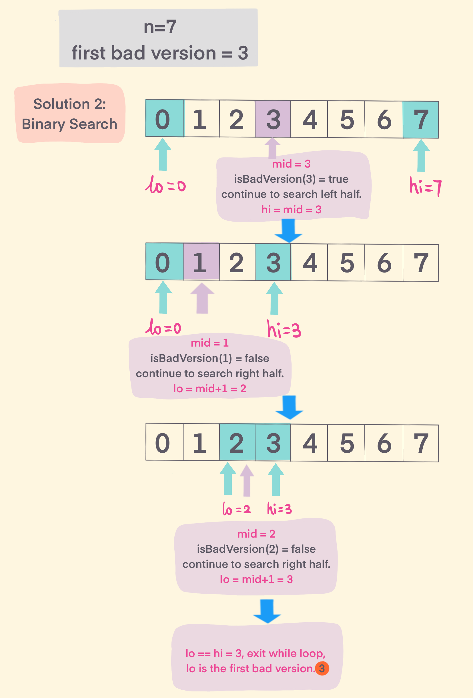

## Problem
[First Bad Version](https://leetcode.com/explore/challenge/card/may-leetcoding-challenge/534/week-1-may-1st-may-7th/3316/)

## Problem Description
```
You are a product manager and currently leading a team to develop a new product. Unfortunately, the latest version of your product fails the quality check. Since each version is developed based on the previous version, all the versions after a bad version are also bad.

Suppose you have n versions [1, 2, ..., n] and you want to find out the first bad one, which causes all the following ones to be bad.

You are given an API bool isBadVersion(version) which will return whether version is bad. Implement a function to find the first bad version. You should minimize the number of calls to the API.

Example:

Given n = 5, and version = 4 is the first bad version.

call isBadVersion(3) -> false
call isBadVersion(5) -> true
call isBadVersion(4) -> true

Then 4 is the first bad version. 
```

## Solution

#### Solution 1 -- Brute force
Naive solution is to iterate [0,n], and call api isFirstBadVersion(i), to check every version start from 0 to n, when isFirstBadVersion(i) is true, then found the first bad version, and return i. 



####Complexity Analysis

**Time Complexity:** `O(N)`

**Space Complexity:** `O(1)`

- N - input version number N 

#### Code

```java
class Solution {
/* The isBadVersion API is defined in the parent class VersionControl.
      boolean isBadVersion(int version); */

    public int firstBadVersion(int n) {
      for (int i = 0; i <= n; i++) {
        if (isBadVersion(i)) {
            return i;
        }
      }
      return 0;
    }
}
```

#### Solution 2 -- Binary Search
From solution 1, brute force observe that iterate number from 0 to n, and it is ordered.to minimize calling api, can do binary search first bad version. 



####Complexity Analysis

**Time Complexity:** `O(log(N))`

**Space Complexity:** `O(1)`

- N - input version number N

#### Code -- Binary Search
```java
class Solution {
    public int firstBadVersion(int n) {
        int lo = 0;
        int hi = n;
        while (lo < hi) {
            int mid = lo + (hi - lo) / 2;
            // if mid is bad versoin, continue search [0,mid] until find first bad version
            if (isBadVersion(mid)) {
                hi = mid;
            } else {
                lo = mid + 1;    
            }
        }
        return lo;
    }

}
```


