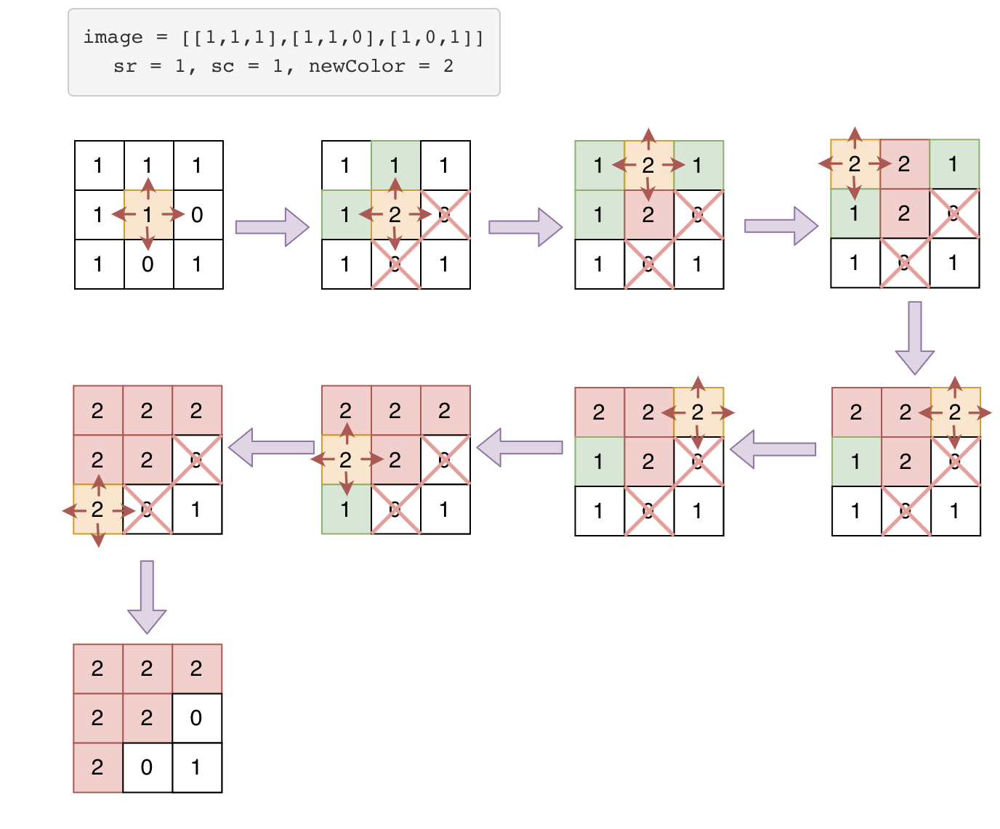

## Problem
[Flood Fill](https://leetcode.com/explore/featured/card/may-leetcoding-challenge/535/week-2-may-8th-may-14th/3326/)

## Problem Description
```
An image is represented by a 2-D array of integers, each integer representing the pixel value of the image (from 0 to 65535).

Given a coordinate (sr, sc) representing the starting pixel (row and column) of the flood fill, and a pixel value newColor, "flood fill" the image.

To perform a "flood fill", consider the starting pixel, plus any pixels connected 4-directionally to the starting pixel of the same color as the starting pixel, plus any pixels connected 4-directionally to those pixels (also with the same color as the starting pixel), and so on. Replace the color of all of the aforementioned pixels with the newColor.

At the end, return the modified image.

Example 1:

Input: 
image = [[1,1,1],[1,1,0],[1,0,1]]
sr = 1, sc = 1, newColor = 2
Output: [[2,2,2],[2,2,0],[2,0,1]]
Explanation: 
From the center of the image (with position (sr, sc) = (1, 1)), all pixels connected 
by a path of the same color as the starting pixel are colored with the new color.
Note the bottom corner is not colored 2, because it is not 4-directionally connected
to the starting pixel.


Note:

- The length of image and image[0] will be in the range [1, 50].
- The given starting pixel will satisfy 0 <= sr < image.length and 0 <= sc < image[0].length.
- The value of each color in image[i][j] and newColor will be an integer in [0, 65535].
```

## Solution
This problem can use DFS or BFS to solve. it is similar to islands problem.

- start from position (sr, sc), traverse from 4 directions, 
    - check each pos is valid, (inside boarder, current color is equal to origin color (image[sr][sc]))
    - if current pos is valid, then continue to check current pos 4 directions. 
    - then reset current color to newColor
    - until checked all possible postions.
- return imag

For example:



####Complexity Analysis

**Time Complexity:** `O(N * M)`

**Space Complexity:** `O(N * M)`

- N - the rows of image
- M - the columns of image

#### Code

**DFS code**
```java
class Solution {
    private static final int[][] DIR = {{0, 1}, {1, 0}, {-1, 0}, {-1, 0}};
    public int[][] floodFill(int[][] image, int sr, int sc, int newColor) {
        int color = image[sr][sc];
        if (color != newColor) {
            dfs(image, sr, sc, newColor, color);
        }
        return image;    
    }

    private void dfs(int[][] image, int r, int c, int newColor, int color) {
        // only when current color is equal to origin color, continue
        if (image[r][c] == color) {
            // reset current to new color
            image[r][c] = newColor;
            // check 4 directions, and continue if nr and nc is valid 
            for (int[] d : DIR) {
                int nr = r + d[0];
                int nc = c + d[1];
                // continue if nr and nc is valid
                if (isValid(image, nr, nc)) {
                    dfs(image, nr, nc, newColor, color);
                }
            }
        }
    }

    private boolean isValid(int[][] image, int r, int c) {
        return r >= 0 && r < image.length && c >= 0 && c < image[0].length;
    }
}

```

**BFS code**

```java
class Solution {
    private static final int[][] DIR = {{0, 1}, {1, 0}, {-1, 0}, {-1, 0}};
    public int[][] floodFill(int[][] image, int sr, int sc, int newColor) {
        int color = image[sr][sc];
        if (newColor == color) return image;
        boolean[][] visited = new boolean[image.length][image[0].length];
        Queue<Pos> queue = new LinkedList<>();
        queue.offer(new Pos(sr, sc));
        while (!queue.isEmpty()) {
            Pos p = queue.poll();
            image[p.x][p.y] = newColor;
            // check 4 directions, if valid pos, add into queue and set current color to newColor
            for (int[] d : DIR) {
                int nr = p.x + d[0];
                int nc = p.y + d[1];
                if (isValid(image, nr, nc, color) && !visited[nr][nc]) {
                    queue.offer(new Pos(nr, nc));
                    visited[nr][nc] = true;
                }
            }
        }
        return image;
    }

    private boolean isValid(int[][] image, int r, int c, color) {
        return r >= 0 && r < image.length && c >= 0 && c < image[0].length && image[r][c] == color ;
    }

    class Pos {
        int x;
        int y;
        public Pos(int x, int y) {
            this.x = x;
            this.y = y;
        }
    }

}
```

