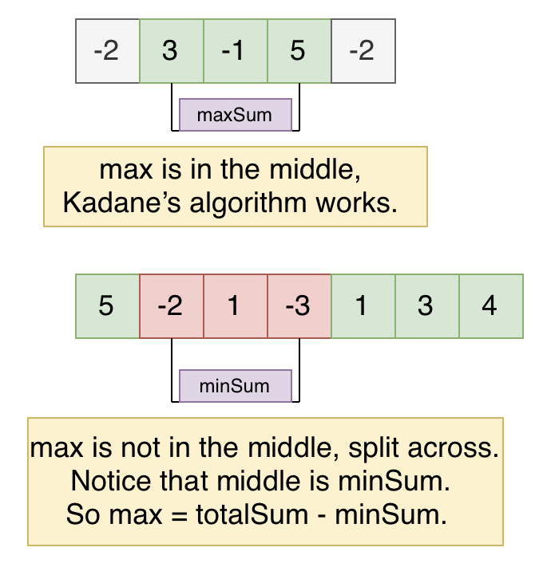

## Problem
[Maximum Sum Circular Subarray](https://leetcode.com/explore/challenge/card/may-leetcoding-challenge/536/week-3-may-15th-may-21st/3330/)

## Problem Description
```
Given a circular array C of integers represented by A, find the maximum possible sum of a non-empty subarray of C.

Here, a circular array means the end of the array connects to the beginning of the array.  (Formally, C[i] = A[i] when 0 <= i < A.length, and C[i+A.length] = C[i] when i >= 0.)

Also, a subarray may only include each element of the fixed buffer A at most once.  (Formally, for a subarray C[i], C[i+1], ..., C[j], there does not exist i <= k1, k2 <= j with k1 % A.length = k2 % A.length.)

 Example 1:

 Input: [1,-2,3,-2]
 Output: 3
 Explanation: Subarray [3] has maximum sum 3

 Example 2:

 Input: [5,-3,5]
 Output: 10
 Explanation: Subarray [5,5] has maximum sum 5 + 5 = 10

 Example 3:

 Input: [3,-1,2,-1]
 Output: 4
 Explanation: Subarray [2,-1,3] has maximum sum 2 + (-1) + 3 = 4

 Example 4:

 Input: [3,-2,2,-3]
 Output: 3
 Explanation: Subarray [3] and [3,-2,2] both have maximum sum 3

 Example 5:

 Input: [-2,-3,-1]
 Output: -1
 Explanation: Subarray [-1] has maximum sum -1
  

Note:

 -  -30000 <= A[i] <= 30000
 -  1 <= A.length <= 30000
```

## Solution
This problem is similar to Maximum Subarray Sum and Minmum Subarray Sum, but in circular, so there are two possible maximum sum subarray:

See below example listed:
1. the scenario as maximum subarray sum, which in the middle not split across.
2. maximum subarray include head and tail, split across. 

From observation, we can see that first scenario, we can calculate maximum subarray sum using Kenade's algorithm, which is:
- keep track current continues subarray maximum sum,
- use global maxSum to track maxSum

For second scenario, we can calculate the minimum subarray sum and total sum, then maximum subarray `maxSum = totalSum - minSum`.

so the solution is to combine maximum subarray sum and minimum subarray sum, at last check whether maximum fall into middle or split across.


For example:



####Complexity Analysis

**Time Complexity:** `O(N)`

**Space Complexity:** `O(1)`

- N - the length of array A

#### Code

```java
class Solution {
    public in maxSubarraySumCircular(int[] A) {
        // record max sum subarray
        int minSum = Integer.MAX_VALUE;
        // record min subarray sum
        int maxSum = Integer.MIN_VALUE;
        // track current subarray sum max 
        int currMax = 0;
        // track current subarray sum min
        int currMin = 0;
        // track total sum
        int sum = 0;
        for (int num : A) {
            // calculate total sum
            sum += num;
            // calculate so far maximum subarray sum
            currMax = Math.max(currMax + num, num);
            maxSum = Math.max(maxSum, currMax);
            // calculate so far minmum subarray sum 
            currMin = Math.min(currMin + num, num);
            minSum = Math.max(minSum, currMin);
        }
        // check wether max subarray sum in the middle or split across
        return maxSum < 0 ? maxSum : Math.max(maxSum, sum - minSum);
    }
}
```
