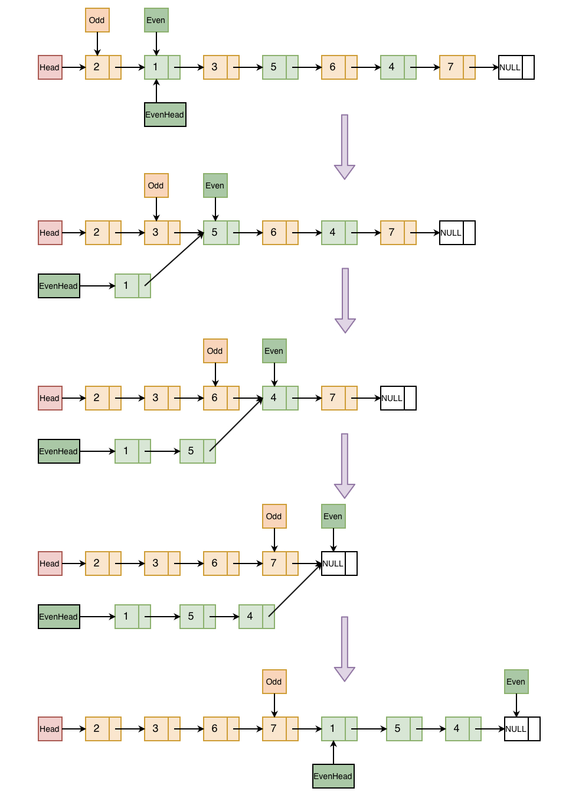

## Problem
[Odd Even Linked List](https://leetcode.com/explore/featured/card/may-leetcoding-challenge/536/week-3-may-15th-may-21st/3331/)

## Problem Description
```
Given a singly linked list, group all odd nodes together followed by the even nodes. Please note here we are talking about the node number and not the value in the nodes.

You should try to do it in place. The program should run in O(1) space complexity and O(nodes) time complexity.

Example 1:

Input: 1->2->3->4->5->NULL
Output: 1->3->5->2->4->NULL

Example 2:

Input: 2->1->3->5->6->4->7->NULL
Output: 2->3->6->7->1->5->4->NULL

Note:

1. The relative order inside both the even and odd groups should remain as it was in the input.
2. The first node is considered odd, the second node even and so on ...
```

## Solution
For example:



####Complexity Analysis

**Time Complexity:** `O(N)`

**Space Complexity:** `O(1)`

- N - the number of nodes in linked list 

#### Code

```java
class Solution {
    /**
 * Definition for singly-linked list.
 * public class ListNode {
 *     int val;
 *     ListNode next;
 *     ListNode() {}
 *     ListNode(int val) { this.val = val; }
 *     ListNode(int val, ListNode next) { this.val = val; this.next = next; }
 * }
 */
class Solution {
    public ListNode oddEvenList(ListNode head) {
        if (head == null) return head;
        ListNode odd = head;
        ListNode even = head.next;
        ListNode evenHead = even;
        while (even != null && even.next != null) {
            odd.next = odd.next.next;
            even.next = even.next.next;
            odd = odd.next;
            even = even.next;
        }
        odd.next = evenHead;
        return head;
    }
}
}
```
