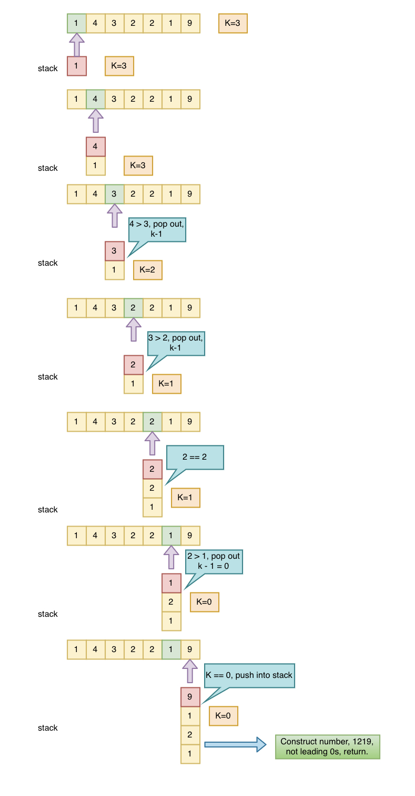

## Problem
[Remove K Digits](https://leetcode.com/explore/challenge/card/may-leetcoding-challenge/535/week-2-may-8th-may-14th/3328/)

## Problem Description
```
Given a non-negative integer num represented as a string, remove k digits from the number so that the new number is the smallest possible.

Note:

The length of num is less than 10002 and will be ≥ k.
The given num does not contain any leading zero.

Example 1:

Input: num = "1432219", k = 3
Output: "1219"
Explanation: Remove the three digits 4, 3, and 2 to form the new number 1219 which is the smallest.

Example 2:

Input: num = "10200", k = 1
Output: "200"
Explanation: Remove the leading 1 and the number is 200. Note that the output must not contain leading zeroes.

Example 3:

Input: num = "10", k = 2
Output: "0"
Explanation: Remove all the digits from the number and it is left with nothing which is 0.
```

## Solution
This problem is a bit tricky, which requires to take care of some cases, using stack to store each character, and for each time, compare the top number with current number, pop out if top > current number, until the end, and continue to pop out top numbers if k still great than 0. steps:
- define stack to store each digit, current index idx.
- for each current digit, while loop check stock top digits,
    - if top digit > current digit (num.charAt(idx)), then stack.pop() to remove top, and k-1 to keep track how many digits left to remove.
    - if top digit < current digit, do nothing. continue
- after check stack top digits, push current digit into stack, `stack.push(idx)`
- continue check next digit, until the last digit, `idx == len`.
- After checking all digits from num, now check whether already remove k digits, and remove top remaining k digits from stack. 
- now digits in stack will format the smallest number.
    - format number from stack.
    - remove leading 0s from number.
    - return smallest number.


For example:



####Complexity Analysis

**Time Complexity:** `O(N)`

**Space Complexity:** `O(N)`

- N - the length of string num

#### Code

```java
class Solution {
    public String removeKDigits(String num, int k) {
        if (num == "0" || num.length() == k) return "0";
        int len = num.length();
        int idx = 0;
        Stack<Character> stack = new Stack<>();
        while (idx < len) {
            while (k > 0 && !stack.isEmpty() && stack.peek() > num.charAt(idx)) {
                stack.pop();
                k--;
            }
            stack.push(num.charAt(idx++));
        }
        // check whether k > 0, pop all remaining k digits from stack
        while (k-- > 0) stack.pop();
        // build min number
        String min = "";
        while (!stack.isEmpty()) min = stack.pop() + min;
        // trim left 0s
        idx = 0;
        len = min.length();
        while (idx < len && min.charAt(idx) == '0') idx++;
        // min number start from non 0 position.
        return idx == len ? "0" : min.substring(idx);
    }
}
```
