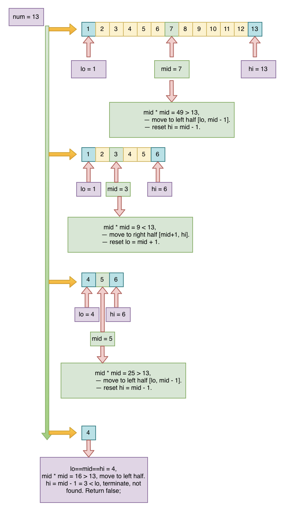

## Problem
[Valid Perfect Square](https://leetcode.com/explore/featured/card/may-leetcoding-challenge/535/week-2-may-8th-may-14th/3324/)

## Problem Description
```
Given a positive integer num, write a function which returns True if num is a perfect square else False.

Note: Do not use any built-in library function such as sqrt.

Example 1:

Input: 16
Output: true

Example 2:

Input: 14
Output: false
```

## Solution
This problem can use binary search from [1, N/2], all other numbers (num) square is less than num / 2. expect 1 and 2, for 1 do additional check.  
- if N == 1, return true. 
- define lo = 1; hi = N / 2;
- check mid = lo + (hi - lo) / 2; -- to avoid overflow
    - check mid * mid compare with current N; 
        - if mid * mid == N, found, return mid and terminate
        - if mid * mid < N, meaning possible number is in right half, reset lo = mid + 1. continue check right half [mid + 1, hi]
        - if mid * mid > N, meaning possible number is in left hald, reset hi = mid - 1. continue check left half [lo, mid - 1]
- until lo == hi, if not found, return false

Note: using long type for lo and hi, and mid, because mid * mid may be overflow.

For example:



####Complexity Analysis

**Time Complexity:** `O(logN)`

**Space Complexity:** `O(1)`

- N - input number N 

#### Code

```java
class Solution {
    public boolean isPerfectSquare(int num) {
        if (num == 1) return true;
        long lo = 1;
        long hi = num / 2;
        while (lo <= hi) {
            long mid = lo + (hi - lo) / 2;
            // found mid, terminate
            if (mid * mid == num) return true;
            if (mid * mid < num) {
                lo = mid + 1;
            } else {
                hi = mid - 1;
            }
        }
        // not found
        return false;
    }
}
```
