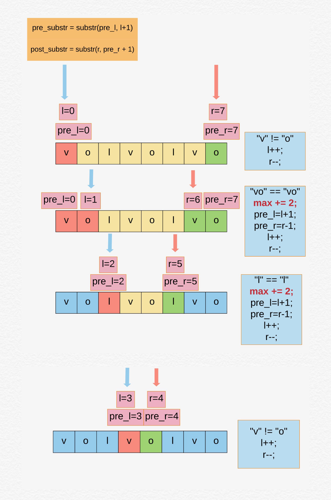
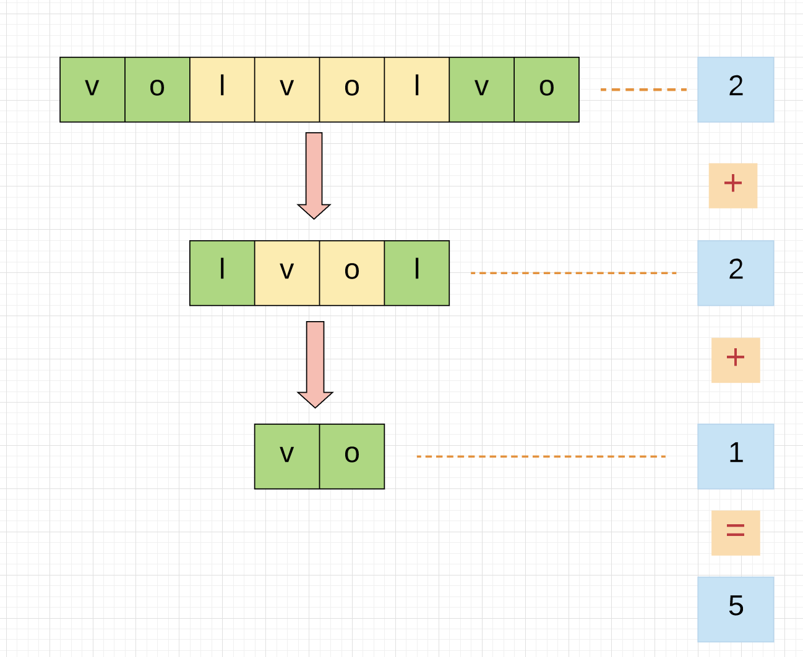

## 题目地址
https://leetcode.com/problems/longest-chunked-palindrome-decomposition/

## 题目描述

```
Return the largest possible k such that there exists a_1, a_2, ..., a_k such that:
   
Each a_i is a non-empty string;
Their concatenation a_1 + a_2 + ... + a_k is equal to text;
For all 1 <= i <= k,  a_i = a_{k+1 - i}.

Example 1:

Input: text = "ghiabcdefhelloadamhelloabcdefghi"
Output: 7
Explanation: We can split the string on "(ghi)(abcdef)(hello)(adam)(hello)(abcdef)(ghi)".
Example 2:

Input: text = "merchant"
Output: 1
Explanation: We can split the string on "(merchant)".
Example 3:

Input: text = "antaprezatepzapreanta"
Output: 11
Explanation: We can split the string on "(a)(nt)(a)(pre)(za)(tpe)(za)(pre)(a)(nt)(a)".
Example 4:

Input: text = "aaa"
Output: 3
Explanation: We can split the string on "(a)(a)(a)".

Constraints:

text consists only of lowercase English characters.
1 <= text.length <= 1000
```

## 思路
给定一个字符串，让求出最多可以切成分块的回文，每一个切分可以是一个子字符串，或者单个字符。

例如， `"aaaaaa"`， 可以切分成 `"aaa)(aaa)" - 2`， 但是这里要求最多分块， 这样就是最多的`"(a)(a)(a)(a)(a)(a)" - 6`

#### 解法一

分析， 满足回文字符串的要求是，从前读和从后读是一样的， 例如， `"aba"， "anna"，"madam"` 等

那么这里就可以分别从前`（l）`和从后`（r）`扫描，`l` 和 `r` 记录前后扫描的`index`， 然后用`pre_l` and `pre_r` 记录前一次扫描到的可以分块的回文位置，

如果子字符串相同`（substr（pre_l, l + 1) `这里包含边界），结果 `+2`，继续扫描。

如果最后剩余一个（奇数个chunk）， 那么直接结果 `+1`， 否则偶数个chunk， 直接返回结果

例如：`"volvolvo"`



#### 复杂度分析
- *时间复杂度:* `O(N^2) - N is the s length, s.substring()时间复杂度是O(n)`
- *空间复杂度:* `O(1) - 没有额外的空间`

#### 解法二

从解法一中我们可以看到`palindome` 左右对称， 所以可以从左和右，用递归求解。

如下图例子， 可以从左起子字符串匹配最右起的子字符串。绿色框框，如果匹配， 递归的计算最长的回文，即每次碰到回文就计算 `+2`，
直到最后字符串中没有匹配的回文，或者是匹配到最后， 退出， 返回结果。

例如：`"volvolvo"`



## 关键点分析
1. 回文，从左到右和从右到左是一样的字符串。那么分别从左和右扫描字符串，每次遇到左右相同，则`+2`, 如果最后没有剩余字符串，则返回结果。如果最后有剩余字符或字符串，则返回结果`+1`
2. 递归解类似, 同时左右对比.

## 代码 (`Java/Python3`)
#### 解法一
*Java code* 
```java
class LongestChunkedPalindromeDecomp {
   public int longestDecomposition2(String text) {
      if (text == null || text.length() == 0) return 0;
      int l = 0;
      int r = text.length() - 1;
      int max = 0;
      int preL = l;
      int preR = r;
      while (l < r) {
        // prefix include right [preL, l]
        String prefix = text.substring(preL, l + 1);
        // suffix include right [r, preR]
        String suffix = text.substring(r, preR + 1);
        if (prefix.equals(suffix)) {
          preL = l + 1;
          preR = r - 1;
          max += 2;
        }
        l++;
        r--;
      }
      // check whether any string left, if so, max+1
      if (preL <= preR) max++;
      return max;
   }
}
```
*Python3 code*
```python
class Solution:
    def longestDecomposition(self, text: str) -> int:
        n = len(text)
        max, l, pre_l, r, pre_r = 0, 0, 0, n - 1, n - 1
        
        while l < r:
            if text[pre_l:l + 1] == text[r:pre_r + 1]:
                pre_l = l + 1
                pre_r = r - 1
                max += 2
            l += 1
            r -= 1
        if pre_l <= pre_r:
            max += 1
        return max
```

####解法二 - 递归
*Java code* 
```java
class LongestChunkedPalindromDecom {
  public int longestDecomposition1(String text) {
      if (text == null || text.length() == 0) return 0;
      int len = text.length();
      for (int i = 0; i < len / 2; i++) {
        String prefix = text.substring(0, i + 1);
        String suffix = text.substring(len - i - 1, len);
        if (prefix.equals(suffix)) {
          return 2 + longestDecomposition1(text.substring(i + 1, len - i - 1));
        }
      }
      return 1;
   }
}
```

*Python3 code*
```python
class Solution:
    def longestDecomposition(self, text: str) -> int:
        n = len(text)
        if not text or n == 0:
            return 0
        for i in range(n // 2):
            if text[0:i+1] == text[n - 1 - i:n]:
                return 2 + self.longestDecomposition(text[i+1:(n - 1 - i)])
        return 1
```


