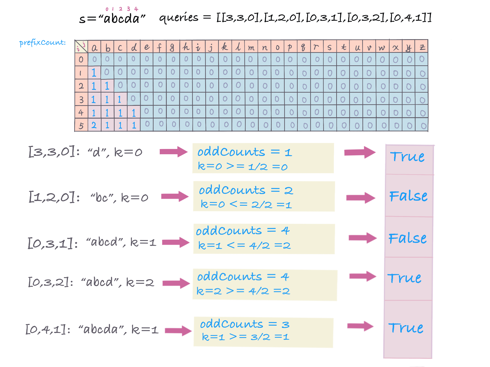

## 题目地址
https://leetcode.com/problems/can-make-palindrome-from-substring/

## 题目描述
```
Given a string s, we make queries on substrings of s.

For each query queries[i] = [left, right, k], we may rearrange the substring s[left], ..., s[right], and then choose up to k of them to replace with any lowercase English letter. 

If the substring is possible to be a palindrome string after the operations above, the result of the query is true. Otherwise, the result is false.

Return an array answer[], where answer[i] is the result of the i-th query queries[i].

Note that: Each letter is counted individually for replacement so if for example s[left..right] = "aaa", and k = 2, we can only replace two of the letters.  (Also, note that the initial string s is never modified by any query.)

Example :

Input: s = "abcda", queries = [[3,3,0],[1,2,0],[0,3,1],[0,3,2],[0,4,1]]
Output: [true,false,false,true,true]
Explanation:
queries[0] : substring = "d", is palidrome.
queries[1] : substring = "bc", is not palidrome.
queries[2] : substring = "abcd", is not palidrome after replacing only 1 character.
queries[3] : substring = "abcd", could be changed to "abba" which is palidrome. Also this can be changed to "baab" first rearrange it "bacd" then replace "cd" with "ab".
queries[4] : substring = "abcda", could be changed to "abcba" which is palidrome.
 
Constraints:

1 <= s.length, queries.length <= 10^5
0 <= queries[i][0] <= queries[i][1] < s.length
0 <= queries[i][2] <= s.length
s only contains lowercase English letters.
```

## 思路
题中给出的字符串只包含小写字母（26个），让你判断给出的子串通过**可重新排列**和**最多替换K个字母**后，该子串是否可以组成回文字符串。

本题中，判断子串是否回文，有两个条件，

- 可重新排列，意思是只要子串中字母能组成回文即可不需要排好序的。
如：`abb` 可以组成回文字符串 `bab`。本身不是回文，但可以重新排列成回文字符串。

- 可最多替换K个字母，意思是本身或者通过从排列不能组成回文字符串，可以替换其中K个字母，也可以是回文字符串。
如：`abcd, k = 2`，可以替换`cd -> ba`, 组成`abba`。 或者是`ab - dc`, 组成`dccd`。
但如果`abcd, k = 1`，无论如何替换，都不可能组成回文字符串。

通过分析，我们可以发现规律，只要计算出子串中有多少个数为奇数的字母 `oddCounts`，如果`oddCounts/2 >= K`, 则我们可通过替换将子串变成回文。
那么这题就变为如何快速的统计出区间出现次数为奇数的字母个数，区间个数，我们可以用**前缀和**个数统计。

1. 为了快速统计区间个数，用前缀和数组`prefixCount[i][j]`记录前`i`个字母中，字母`j`出现的个数。

2. 统计区间`[start, end]`内出现的次数为奇数的字母个数 
`oddCounts += prefixCount[end+1][currChar] - prefixcount[start][currChar]` 。

3. 如果`oddCounts/2 >= K`， 则可以通过替换将子串变成回文。

如下图构建的前缀和数组`prefixCount[i][j]`, 由于这里字符串只包含26个小写字母，所以近似常数时间复杂度。


 

#### 复杂度分析
- *时间复杂度:* `O(m * 26) - m is queries length`
- *空间复杂度:* `O(n * 26) - n is s length, n * 26 prefixcount matrix`

>**Note**, 可以用HashMap，这样不用每次都扫描26个字母，只要扫描出现过的字母即可。


**判断字符串是否是回文**：

回文字符串的特点：正读和反渎都是一样。如`madam，noon, 12321， aaaa` 等。

判断回文方法：

1. 第一种解法：直接reverse字符串，然后判断两字符串是否相同。`return s == reverse(s)` 

2. 第二种解法：前后两个指针`（left， right）`，`left` 从`0`开始，`right`从字符串最后一个字符开始，满足条件`（left < right)` 比较
`s[left]` 与` s[right]`是否相同, 

    - 相同，则继续下一个，`left往右移，left++`, `right往左移，right--` 

    - 不同，则直接`return false`。
    
  
  
```java
class ValidPalindrome {
  public boolean isPalindrome(String s) {
    if (s == null || s.length() < 2) return true;
    int left = 0;
    int right = s.length() - 1;
    while (left < right) {
      if (s.charAt(left) != s.charAt(right)) return false;
      left++;
      right--;
    }
    return true;
  }
}
```

## 关键点分析

- 前缀和数组计算前`i`个字母，`j`字母出现的次数
- 每一次query，扫描计算出次数为奇数的字母的个数，与`k`比较

## 代码 (`Java/Python3`)
*Java code*
```java
public class CanMakePalindromeFromSubstring {
  public List<Boolean> canMakePaliQueries(String s, int[][] queries) {
    int n = s.length();
    int[][] prefixCount = new int[n + 1][26];
    // prefixCount[i][j] matrix, calculate number of letter from range [0,i] for j letter.
    for (int i = 0; i < n; i++) {
      prefixCount[i + 1] = prefixCount[i].clone();
      prefixCount[i + 1][s.charAt(i) - 'a']++;
    }
    List<Boolean> res = new ArrayList<>();
    for (int[] q : queries) {
      int start = q[0];
      int end = q[1];
      int k = q[2];
      int count = 0;
      // count odd letters number from range [start, end]
      for (int i = 0; i < 26; i++) {
        count += (prefixCount[end + 1][i] - prefixCount[start][i]) % 2;
      }
      res.add(count / 2 <= k);
    }
    return res;
  }
}
```

*Python3 code* (slow :( )
```python
class Solution:
    def canMakePaliQueries(self, s: str, queries: List[List[int]]) -> List[bool]:
        prefix_sum = [[0] * 26]
        for i, char in enumerate(s):
            prefix_sum.append(prefix_sum[i][:])
            prefix_sum[i + 1][ord(char) - ord('a')] += 1
        res = [True] * len(queries)
        for i, (start, end, k) in enumerate(queries):
            odd_count = 0
            for j in range(26):
                odd_count += (prefix_sum[end + 1][j] - prefix_sum[start][j]) % 2
            res[i] = (odd_count // 2 <= k)
        return res
```
