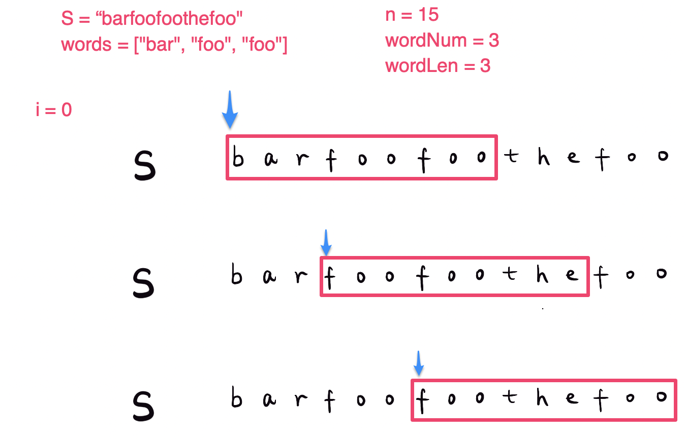
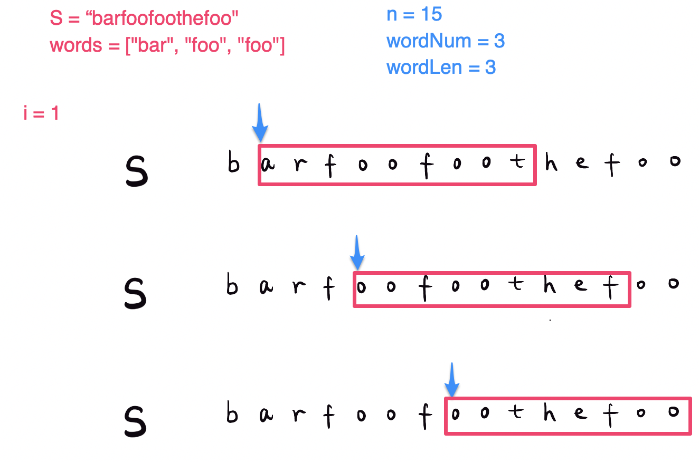
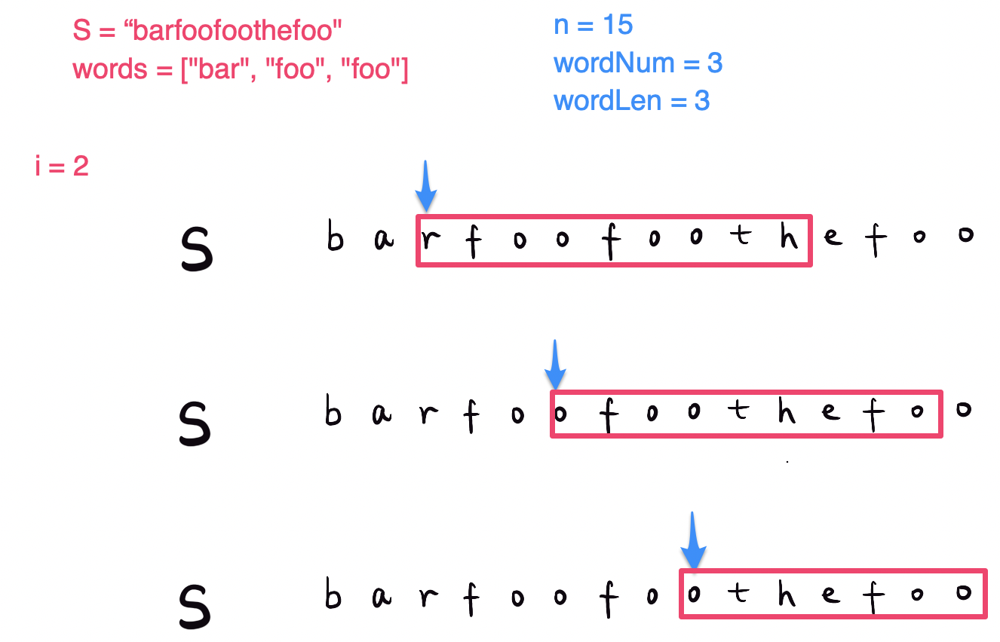
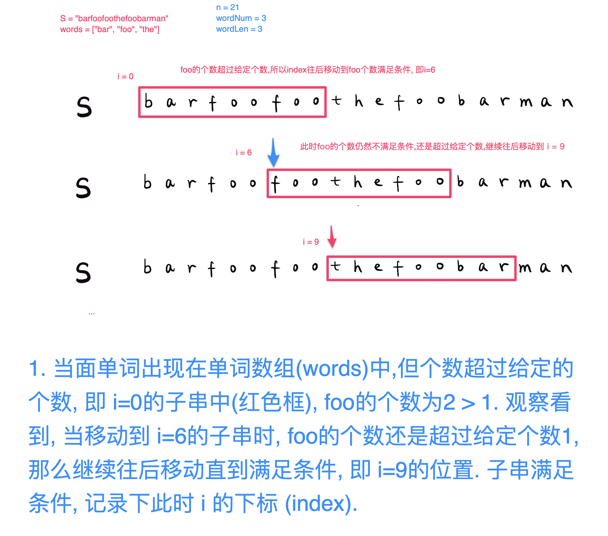
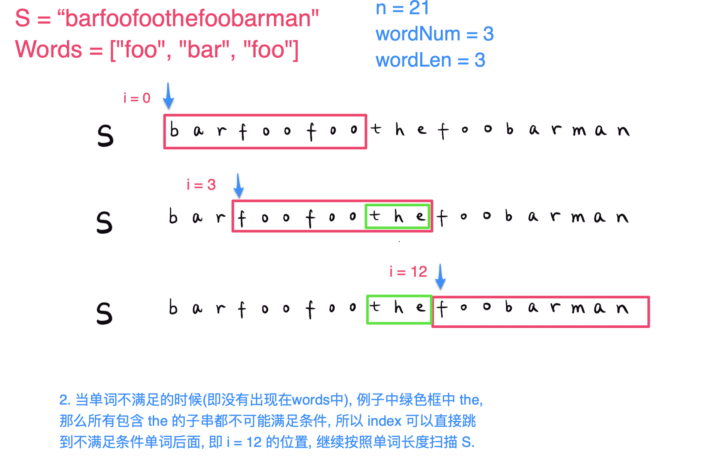

## 题目地址
https://leetcode.com/problems/substring-with-concatenation-of-all-words/

## 题目描述
```
You are given a string, s, and a list of words, words, that are all of the same length. Find all starting indices of substring(s)
in s that is a concatenation of each word in words exactly once and without any intervening characters.

Example 1:
Input:
  s = "barfoothefoobarman",
  words = ["foo","bar"]
Output: [0,9]
Explanation: Substrings starting at index 0 and 9 are "barfoor" and "foobar" respectively.
The output order does not matter, returning [9,0] is fine too.

Example 2:
Input:
  s = "wordgoodgoodgoodbestword",
  words = ["word","good","best","word"]
Output: []
```

## 思路
题意: 给定一个字符串`(String s)`, 给定`n`个单词组成的字符串数组`(String[] words)`, 找出所有子串`(substring)`的起始下标`(start index)`, 
使得该子串包含所有的单词, 每个单词的个数也要相同(子串中单词顺序任意).

#### 解法一 - 暴力

先简单,直接,暴力的解 (暴力出奇迹, 😄).

遍历字符`s`,判断每个子串是匹配字符串数组中所有单词, 如果匹配, 记录下标 (`index`), 条件中每个单词的长度是相同的, 所以从当前下标, 可以很快得到单词长度的子串并进行比较.

由于不考虑顺序,这里可以用`Hashmap`先保存所有单词,并记录单词出现的次数. `Map<Key, Value> `- `key` 是单词, `value` 是单词的个数.

遍历字符`s`的时候,扫描并记录子串的单词和单词个数,用另一个`HashMap`保存, (`key` 是当前子串的单词, `value` 是当前子串单词出现的个数), 并与单词数组中单词和单词出现个数比较,

1. 如果当前单词不在单词数组中,那么以当前字符开头的子串不可能满足情况, 提前结束, 往后移动到下一个字符的子串.
2. 如果当前单词个数超过单词数组, 也不可能满足, 结束, 往后移动到下一个
3. 满足的单词的数量(`count`)加`1`.
4. 比较满足的单词数量`(count == wordNum)`, 满足, 记录下当前下标(`index`), 移动到下一个字符
5. 每次移动第二个HashMap清空, 重新计算

例子: 
```
s = "barfoothefoobarman"
words = ["foo", "bar"]
单词长度: wordLen = 3
单词个数: wordNum = 2
字符串长度: len = 17

Words Map = {[foo:1], [bar:1]}
i=0
    子串 Map = {}
    | b a r f o o t h e f o o b a r m a n 
    当前子串: "barfoo", 满足条件, res=[0]
i=1
    子串 Map = {}
    b | a r f o o t h e f o o b a r m a n 
    当前子串: "arfoot", 不满足条件, 退出, 移到下一个, res=[0] 
i=2
    子串 Map = {}
    b a | r f o o t h e f o o b a r m a n 
    当前子串: "rfooth", 不满足条件, 退出, 移到下一个, res=[0]
.
.
.
i=9
    子串 Map = {}
    b a r f o o t h e | f o o b a r m a n 
    当前子串: "foobar", 满足条件, res=[0, 9] 
.
.
.
i=13, 退出, 剩余子串长度不满足. res=[0, 9]
```
#### 复杂度分析

*时间复杂度(TC)*: `O(n * m) - n是s的长度, m是单词(words)的个数`.

*空间复杂度(SC)*: `O(m)`

### 解法二

参考 [shichaotan的解法](https://leetcode.com/problems/substring-with-concatenation-of-all-words/discuss/13656/An-O(N)-solution-with-detailed-explanation)

在解法一中,我们每次移动一个字符(`char`), 这样就造成了很多不必要的重复计算. 在解法二中,每次移动一个单词(`word`), 这样可以以word长度分类移动, 例如: `word`长度为`3`, 那么就可以分为`3`类来移动.

例子如下图, 对于单词(`word`)长度为`3`, 分为 `i = 0, i = 1, i = 2` 三类移动单词的距离.







从例子中,我们可以发现,按单词(`word`)移动,在解法一中,考虑了三种情况,那么解法二可以针对这三点进行优化:

1. 当面单词不满足(不在给定单词数组(`words`)中). 
2. 当面单词出现在单词数组(`words`)中,但个数超过给定的个数
3. 往后移动的过程,不需要每次都清空`HashMap`, 造成重复计算, 浪费资源.

对于1中单词不满足了, 可以略过(skip)掉不满足的这个单词前面所有的移动, 直接移动到下一个单词. 例如:


对于2中单词满足, 但是个数超过给定个数的情况,


这样就不需要每次移动都清空 `HashMap`, 而是当单词不满足的情况下, 清空`HashMap` 即可.

相较于解法一中, 每次移动一个字符都需要清空`HashMap`,节省很多时间的计算

#### 复杂度分析

*时间复杂度(TC)*: `O(n) - n 为 S 的长度`

*空间复杂度(SC)*: `O(m) - m 为单词个数`


## 代码 （Java/Python3）

**解法一 - 暴力**

```java
class ConcateSubstringWithAllWords {
  public List<Integer> findSubstring(String s, String[] words) {
    List<Integer> res = new ArrayList<>();
    if (s == null || words == null || s.length() < words.length || words.length == 0) return res;
    Map<String, Integer> wordsMap = new HashMap<>();
    for (String w : words) {
      wordsMap.put(w, wordsMap.getOrDefault(w, 0) + 1);
    }
    int len = s.length();
    int wordNum = words.length;
    int wordLen = words[0].length();
    if (len < wordNum * wordLen) return res;
    for (int i = 0; i < len - wordNum * wordLen + 1; i++) {
      Map<String, Integer> subMap = new HashMap<>();
      int currCount = 0;
      while (currCount < wordNum) {
        String currWord = s.substring(currCount * wordLen + i, (currCount + 1) * wordLen + i);
        if (!wordsMap.containsKey(currWord)) break;
        subMap.put(currWord, subMap.getOrDefault(currWord, 0) + 1);
        if (subMap.get(currWord) > wordsMap.get(currWord)) break;
        currCount++;
      }
      if (currCount == wordNum) {
        res.add(i);
      }
    }
    return res;
  }
}
```

** 解法二**

```java
class ConcateSubstringWithAllWords {
  public static List<Integer> findSubstring2(String s, String[] words) {
    // basic cases 
    if (s == null || words == null || s.length() < words.length || words.length == 0) return res;
    List<Integer> res = new ArrayList<>();
    final Map<String, Integer> wordsMap = new HashMap<>();
    for (final String word : words) {
      wordsMap.put(word, wordsMap.getOrDefault(word, 0) + 1);
    }
    final int len = s.length();
    final int wordNum = words.length;
    final int wordLen = words[0].length();
    for (int i = 0; i < wordLen; i++) {
      int l = i, count = 0;
      final Map<String, Integer> subMap = new HashMap<>();
      for (int r = i; r <= len - wordLen; r += wordLen) {
        final String word = s.substring(r, r + wordLen);
        // 1. 不满足条件,直接跳到单词后面, 清空map
        if (!wordsMap.containsKey(word)) {
          subMap.clear();
          count = 0;
          l = r + wordLen;
          continue;
        }
        subMap.put(word, subMap.getOrDefault(word, 0) + 1);
        if (subMap.get(word) <= wordsMap.get(word)) {
          count++;
        } else {
        // 2. 满足条件, 当时个数超过, 那么往前移动直到个数满足的index
          while (subMap.get(word) > wordsMap.get(word)) {
            final String first = s.substring(l, l += wordLen);
            subMap.put(first, subMap.getOrDefault(first, 0) - 1);
            if (subMap.get(first) < wordsMap.getOrDefault(first, 0)) {
              count--;
            }
          }
        }
        if (count == wordNum) {
          res.add(l);
          count--;
          final String first = s.substring(l, l += wordLen);
          subMap.put(first, subMap.get(first) - 1);
        }
      }
    }
    return res;
  }
}
```

**Python** code from **[@sunboman](https://github.com/sunboman)**

```python
from typing import List
import collections

class Solution:
    def findSubstring(self, s: str, words: List[str]) -> List[int]:
        if not s or not words:
            return []
        w_num = len(words)
        w_len = len(words[0])
        w_count = collections.Counter(words)
        res = []
        for i in range(w_len):
            temp_count = collections.defaultdict(int)
            left = i
            for right in range(i, len(s) - w_len + 1, w_len):
                temp_word = s[right: right + w_len]
                if w_count[temp_word] > 0:
                    temp_count[temp_word] += 1
                    while temp_count[temp_word] > w_count[temp_word]:
                        temp_count[s[left: left + w_len]] -= 1
                        left += w_len
                    if right + w_len - left == w_num * w_len:
                        res.append(left)
                        temp_count[s[left: left + w_len]] -= 1
                        left += w_len
                else:
                    left = right + w_len
                    temp_count.clear()
        return res
```

## 相似题目
[Minimum Window Substring](https://leetcode.com/problems/minimum-window-substring/)