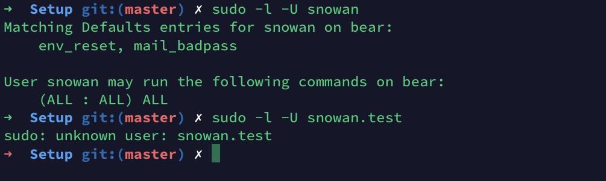

# How to add a new user into Ubuntu and setup ssh key?

### Create a new user
`sudo adduser <newusername>`

i.e: create a new username: snowan
```
$ sudo adduser snowan

Adding user `snowan' ...
Adding new group `snowan' (1005) ...
Adding new user `snowan' (1004) with group `snowan' ...
Creating home directory `/home/snowan' ...
Copying files from `/etc/skel' ...
Enter new UNIX password: 
Retype new UNIX password: 
passwd: password updated successfully
Changing the user information for snowan
Enter the new value, or press ENTER for the default
 Full Name []: snowan               
 Room Number []: 
 Work Phone []: 
 Home Phone []:
 Other []: 
Is the information correct? [Y/n] Y
```
Now you've already created a new user, username: snowan

Next you want to add new user to `sudo` group, so new user can have `sudo` privileges.

### Add user to the `sudo` group
`sudo usermod -aG sudo <username>`

i.e. `sudo usermod -aG sudo snowan`

Now you've added new user into `sudo` group, and you want to verify it's added successfully.

### Verify `sudo` user group
1. Login with newly added user
`su - <username>`

i.e. `su - snowan` and enter password you added for this user

2. Verify `sudo` group user privileges
`sudo ls -la /root` or `sudo -l -U <username>` 

for example: `snowan` is sudo user and `snowan.test` is not user, 



Now you want to be able to `ssh` into remote server without password. you need to create private and public key. 


## Add public key to allow remote `SSH` login for new user
1. Go to client server and create ssh key
`ssh-keygen -t rsa` and add file `snowan-rsa` under folder `~/.ssh/` 

under `~/.ssh/` you will see 2 files 
- `snowan-rsa` -- this is private key
- `snowan-rsa.pub` -- this is public key

and you need to add `snowan-rsa.pub` public key into server `~/.ssh/`

2. Copy public key over to server (snowan)
`ssh-copy-id ~/.ssh/snowan-rsa.pub <remote server>` 

i.e `ssh-copy-id ~/.ssh/snowan-rsa.pub snowwan@localhost`

**NOTE:** If you encounter permission denied (publickey) issue, it is possible that your server do not allow passwordAuthentication. how to fix?

- go to server (snowan) -- `su - snowan` 
- go to `/etc/ssh` -- `cd /etc/ssh`
- check `PasswordAuthentication` in `sshd_config` file, by default this value is set to `no`, and to allow copy public key over from client server, temporary set to `yes`
- `vim sshd_config` and then set `PasswordAuthentication yes` 
- go to client server, and copy public key over to server (snowan), it should copy over. 

Now you've copied public key over to server, you need to verify ssh is working

## Verify ssh key working
- Add ssh private key into host in config under `~/.ssh`
```
Host snowwan
    HostName <ip address> -- i.e. 127.0.0.1
    User snowan
    IdentityFile "~/.ssh/snowan_rsa"
```

- now go to terminal, `ssh snowan`, and you should ssh into remote server


Congrates, you've already added a new user and ssh into remote server! :) 
