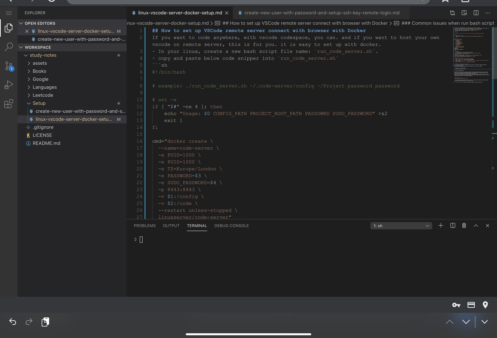

## How to set up VSCode remote server connect with browser with Docker
If you want to code anywhere, with vscode codespace, you can. and if you want to host your own vscode on remote server, this is for you. it is easy to set up with docker.
- In your linux, create a new bash script file name: `run_code_server.sh`. 
- copy and paste below code snipper into `run_code_server.sh`

```
#!/bin/bash

# example: ./run_code_server.sh ~/.code-server/config ~/Project password password

# set -x
if [ "$#" -ne 4 ]; then
	echo "Usage: $0 CONFIG_PATH PROJECT_ROOT_PATH PASSOWRD SUDO_PASSWORD" >&2
	exit 1
fi

cmd="docker create \
  --name=code-server \
  -e PUID=1000 \
  -e PGID=1000 \
  -e TZ=Europe/London \
  -e PASSWORD=$3 \
  -e SUDO_PASSWORD=$4 \
  -p 8443:8443 \
  -v $1:/config \
  -v $2:/code \
  --restart unless-stopped \
  linuxserver/code-server"
echo $cmd
eval $cmd
docker start code-server
# set +x
```
- save script
- run script (make sure you have docker installed.)

`./run_code_server.sh ~/.code-server/config ~/Project password password`

- now check whether docker container is up. 

`docker ps -a`

You will see container name: `code-server` up and running with port: `8443`
- now you can access vscode in your browser

`http://<your-server-ip>:8443` ie. `http://127.0.0.1:8443`

For example: my up and running vscode opened in browser


### Docker basic tips
- `docker ps -a` -- check all your docker containers
- `docker container ls` -- list all running containers
- `docker container stop <container-name/container-id>` ie. `docker container stop code-server` -- stop container
- `docker rm <container-name>` -- remove docker container


### Common issues when run bash script
1. If you don't have Docker installed, install docker [here](https://runnable.com/docker/install-docker-on-linux)
2. If you run into bash script permission denied on Linux, run below command

`chmod +x <your bash script>` 

For example, code server script:

`chmod +x ./run-code-server.sh`

3. If you see below errors
```
Got permission denied while trying to connect to the Docker daemon socket at unix:///var/run/docker.sock: Post http://%2Fvar%2Frun%2Fdocker.sock/v1.40/containers/create?name=code-server: dial unix /var/run/docker.sock: connect: permission denied
Got permission denied while trying to connect to the Docker daemon socket at unix:///var/run/docker.sock: Post http://%2Fvar%2Frun%2Fdocker.sock/v1.40/containers/code-server/start: dial unix /var/run/docker.sock: connect: permission denied
```

**Solution is to run**
`sudo chmod 666 /var/run/docker.sock`

- For more details refer to offical Docker docs [here](https://docs.docker.com/install/linux/linux-postinstall/#manage-docker-as-a-non-root-user)

- [Linuxserver docker code](https://github.com/linuxserver/docker-code-server)
