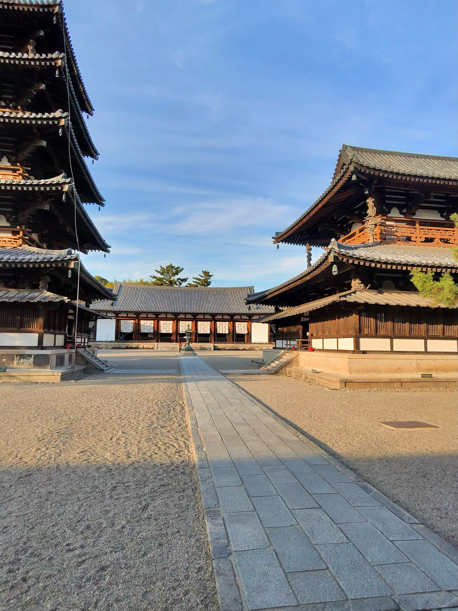
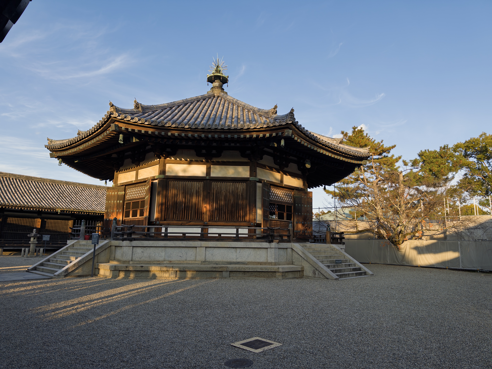
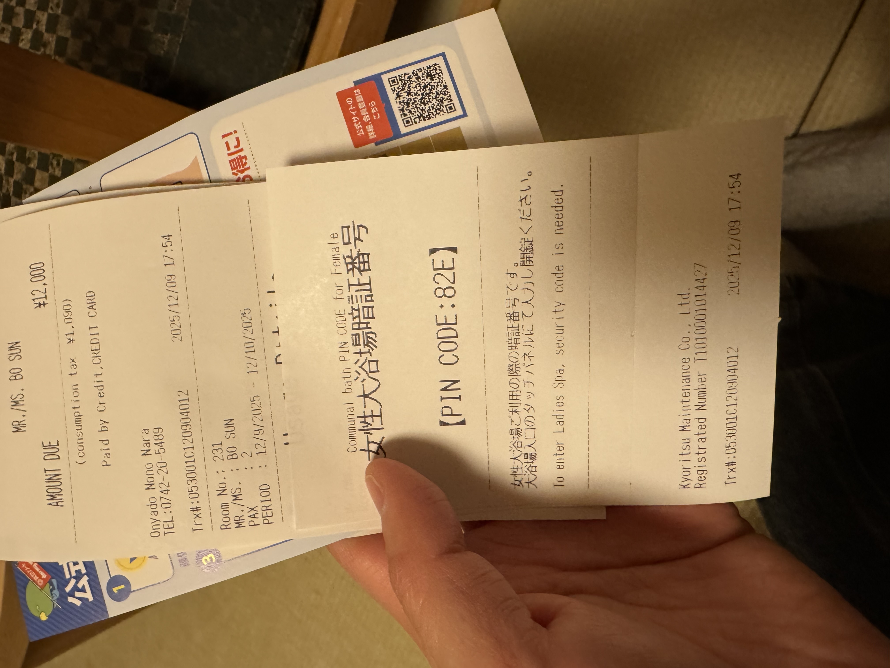
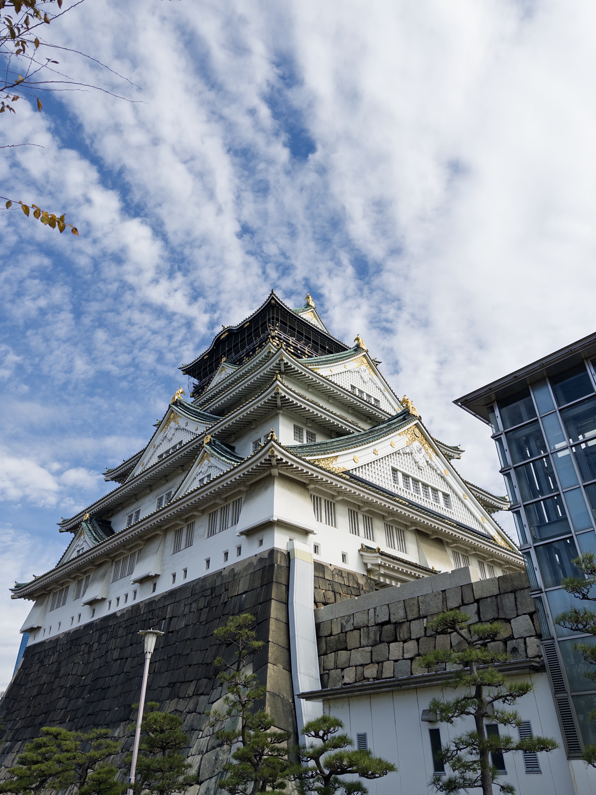
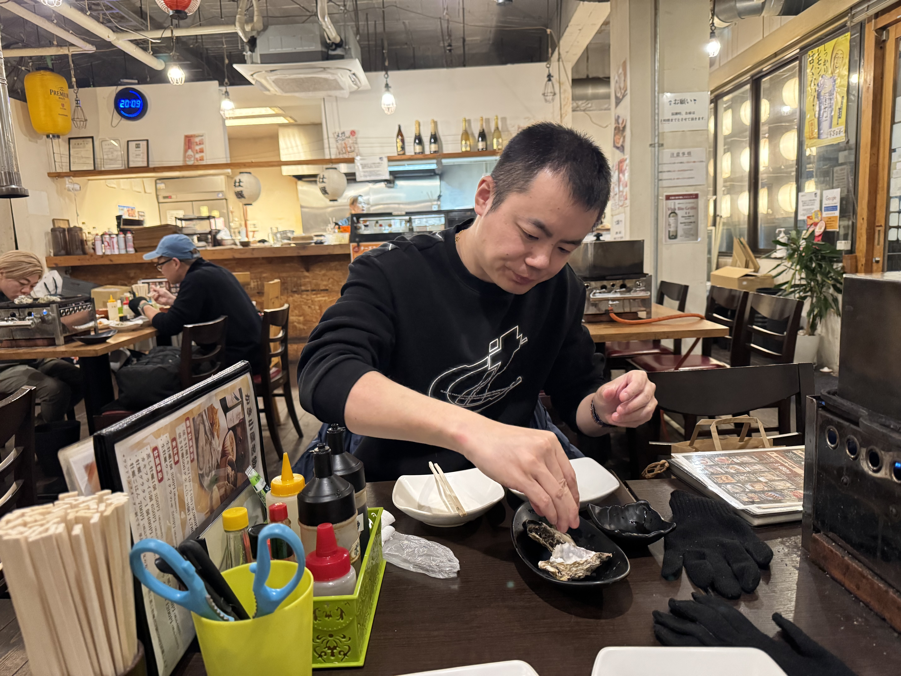
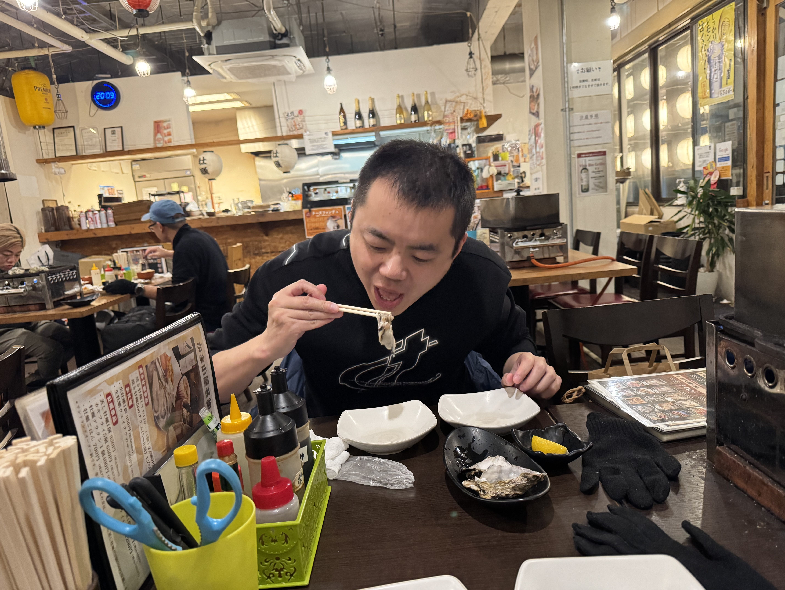
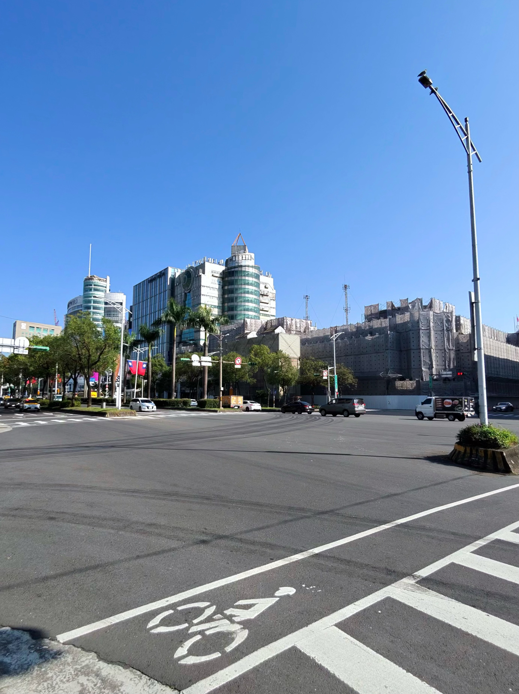

# 双城记：古都与宝藏之旅
# Japan & Taiwan Adventure: Dec 5-19, 2025

## Trip Overview

A 15-day cultural journey through Japan's ancient temples and Taiwan's treasures with my partner. From Tokyo's energy to Kyoto's zen gardens, Nara's bowing deer, Osaka's food scene, and Taiwan's night markets and museums—this was a trip of ancient capitals and timeless treasures.

**Destinations:** Tokyo → Kyoto → Nara → Osaka (Japan) → Taipei → Chiayi → Tainan (Taiwan)
**Duration:** December 5-19, 2025 (15 days)
**Travel Style:** Cultural exploration, temple hopping, museum visits, food hunting
**Companions:** Traveling with my partner
**Theme:** 一场穿梭于古寺与博物的探寻 (A journey through ancient temples and museums)

---

## Days 1-2: December 5-6 - Arriving in Tokyo

We landed at Tokyo (HND/NRT) after the long flight from SFO. The first couple of days were about adjusting to the jet lag and getting our bearings. We stayed near Tokyo Station—convenient for the shinkansen we'd be taking soon.

Optional walks around the Imperial Palace outer gardens and Marunouchi district helped us shake off the travel fatigue. Tokyo's December air was crisp and refreshing.

---

## Day 3: December 7 - Shinkansen to Kyoto

The day we'd been waiting for—our first shinkansen ride!

**Pro tip from the plan:** Book an E seat (right side) and about 40-45 minutes after departure, you get a stunning view of **Mount Fuji** if the weather cooperates. We were lucky—the mountain appeared through the clouds, snow-capped and majestic.

Two and a half hours later, we arrived in **Kyoto**, Japan's cultural heart. After checking in, we headed straight to the **Higashiyama area**:

- **Kiyomizu-dera** (清水寺) - The famous wooden stage with panoramic views
- Wandered through **Ninenzaka & Sannenzaka** - Traditional stone-paved lanes
- Evening in **Gion** or **Pontocho** for dinner

---

## Day 4: December 8 - Kyoto: Golden Pavilion, Rock Garden & Bamboo

A full day exploring Kyoto's northern and western highlights:

### Morning: Northern Kyoto
- **Kinkaku-ji** (金閣寺) - The Golden Pavilion's reflection on the mirror pond is iconic
- **Ryoan-ji** (龍安寺) - Meditated before the famous rock garden, trying to see all 15 stones

### Afternoon: Arashiyama
- **Bamboo Grove** (竹林小径) - Walking through towering bamboo stalks
- **Tenryu-ji Temple** (天龍寺) - UNESCO World Heritage site with beautiful gardens
- **Togetsukyo Bridge** (渡月橋) - Strolled along the riverbank

### Evening: Nanzen-ji
- **Nanzen-ji** (南禅寺) - The massive Sanmon gate and the red brick aqueduct were stunning in the autumn light

---

## Day 5: December 9 - Nara: Sacred Deer & Great Buddha

Day trip from Kyoto via Kintetsu Railway to **Nara**, the ancient capital.

### Morning: National Treasures
- **Kofuku-ji** (興福寺) - The iconic five-story pagoda and national treasure Buddha statues
- **Nara National Museum** (奈良国立博物館) - Deep dive into Buddhist art

### Noon: The Great Buddha
- **Todai-ji** (東大寺) - Home to the 15-meter bronze Daibutsu, one of the largest wooden buildings in the world

### Afternoon: Shrine & Old Town
- **Kasuga Taisha** (春日大社) - Walked through thousands of stone lanterns
- **Naramachi** (奈良町) - Traditional merchant district, great for lunch and souvenirs

### The Famous Bowing Deer
The deer here are sacred messengers of the gods, and they've learned to **bow** for treats. You bow, they bow back, then they expect a shika senbei (deer cracker). It's adorable until you run out of crackers and they start nudging you aggressively. Hilarious and slightly terrifying.

---

## Day 6: December 10 - Nara Temples & Osaka Night

### Morning: World's Oldest Wooden Buildings
- **Horyu-ji** (法隆寺) - The world's oldest wooden structures, dating back to the 7th century. We spent over 2 hours here, mesmerized by the five-story pagoda.

### Afternoon: Monk Jianzhen's Legacy
- **Toshodai-ji** (唐招提寺) - Founded by the Chinese monk Jianzhen (Ganjin), who crossed the sea six times to bring Buddhism to Japan
- Optional: **Yakushi-ji** (薬師寺)

### Evening: Hello Osaka!
Took the train from Nara to **Osaka** and checked into our hotel. First stop: **Dotonbori** (道頓堀)!

The neon lights reflecting on the canal, the Glico running man sign, and the smell of takoyaki in the air—Osaka's energy hit us immediately. We stuffed ourselves with:
- **Takoyaki** (章魚燒) - Crispy octopus balls
- Local beer and street food

---

## Day 7: December 11 - Osaka: Castle & Food

### Morning Options (we chose the castle!)
- **Osaka Castle** (大阪城) - Toyotomi Hideyoshi's legacy, white walls and gold accents against the December sky

### Afternoon & Evening
- Shopping and packing—preparing for the Taiwan leg
- Optional: **Umeda** bookstores (Maruzen & Junkudo)
- Dinner back at Dotonbori or exploring **Shinsekai** (新世界) for kushikatsu

One memorable dinner was at a local izakaya where we demolished plates of fresh **oysters**—plump, briny, and perfect with sake.

---

## Day 8: December 12 - Crossing the Sea: Osaka → Taipei

### Morning
Last Japanese breakfast in Osaka, savoring every bite.

### Afternoon
✈️ **KIX → TPE** - Flight from Kansai International Airport to Taipei

### Evening
Arrived in Taipei! The energy shift was immediate—from Japan's understated elegance to Taiwan's vibrant chaos.

First night mission: **Raohe Street Night Market** (饒河夜市)—and what an introduction to Taiwan it was!

### First Night: Raohe in the Rain

It was **pouring rain** when we arrived at Raohe, but that didn't stop anyone. The market was packed despite the weather—umbrellas bumping into each other, steam rising from food stalls, the smell of pepper buns and grilled meats mixing with the rain.

The food was incredible and **ridiculously cheap**. We completely lost control. One stall led to another, and before we knew it, we had eaten:
- Pepper buns (胡椒餅) fresh from the clay oven
- Stinky tofu (finally brave enough to try it!)
- Oyster omelette
- Grilled squid on a stick
- Bubble tea (multiple cups)
- Fried chicken cutlet
- Some mystery meat skewer that was amazing
- And probably five more things we forgot

We stumbled back to the hotel stuffed beyond belief, rain-soaked but completely happy. This set the tone for our entire Taiwan food adventure.

### Our Night Market Marathon (5 markets!)

Over our week in Taiwan, we hit **five different night markets**:

1. **Raohe Street Night Market** (饒河夜市) - **OUR FAVORITE!** Best variety, tastiest food, pepper buns are legendary. Even in heavy rain, totally worth it.
2. **Shilin Night Market** (士林夜市) - The biggest and most famous, underground food court is massive
3. **Ningxia Night Market** (寧夏夜市) - Local favorite, less touristy, incredible food density
4. **Linjiang Street Night Market** (臨江街夜市/通化夜市) - Near Taipei 101, great for late-night bites
5. **Nanjichang Night Market** (南機場夜市) - Hidden gem, where locals actually eat, amazing dan bing

**Verdict:** Raohe wins for variety and taste. Nanjichang wins for authenticity. Skip the Shilin crowds if you're short on time.

---

## Day 9: December 13 - Classic Taipei Day

### Morning
- **Chiang Kai-shek Memorial Hall** (中正紀念堂) - Watched the changing of the guard ceremony

### Afternoon
- **Longshan Temple** (龍山寺) - Taipei's most famous temple, incense smoke and prayers
- **Bopiliao Historical Block** (剝皮寮) - Beautifully preserved old street

### Night
- **Raohe Street Night Market** (饒河夜市) - The famous pepper buns (胡椒餅) are a must!
- Bookstore hopping: **Pon Ding** (朋丁) - A beautiful independent bookstore

---

## Day 10: December 14 - HSR South: Chiayi & NPM Southern Branch

### The Mission
🚄 **High Speed Rail** from Taipei to **Chiayi** (嘉義)

**Core Mission:** Visit the **National Palace Museum Southern Branch** (故宮南院) for the 100th Anniversary Special Exhibition!

The museum's modern architecture is stunning, and the exhibits rival the main branch in Taipei.

### Evening
Continued to **Tainan** (台南), Taiwan's ancient capital. Checked into our hotel and began the **ancient capital food journey**:
- **Shrimp rolls** (蝦卷)
- **Oyster omelettes** (蚵仔煎)
- All the local Tainan specialties

---

## Day 11: December 15 - Tainan & Back to Taipei

### Morning: Tainan Historical Sites
- **Chikan Tower** (赤崁樓) - Dutch and Chinese architecture fusion
- **Anping Fort** (安平古堡) - Exploring Taiwan's colonial history
- **Anping Tree House** (安平樹屋) - Banyan trees consuming an old warehouse

### Afternoon
🚄 HSR back to Taipei

### Evening: Dadaocheng
- **Dihua Street** (迪化街) - Taipei's oldest street! Traditional medicine shops, fabric stores, tea houses, and cute boutiques in vintage buildings
- Bought tea, dried fruits, and way too many souvenirs
- **Ningxia Night Market** (寧夏夜市) - Local favorite, less touristy, incredible food density

---

## Day 12: December 16 - National Palace Museum Day

### All-Day Mission: 故宮博物院

The **National Palace Museum** (國立故宮博物院) deserves a full day. Home to one of the world's largest collections of Chinese art.

**Viewing Strategy:**
1. Head straight to the **"100 Years of NPM"** special exhibition
2. Permanent highlights: **Mao Gong Ding** (毛公鼎), **Jadeite Cabbage** (翠玉白菜), **Meat-Shaped Stone** (肉形石)
3. Rotating calligraphy and painting exhibitions

**Lunch:** Silks Palace (故宮晶華) inside the museum or the cafeteria

**Must-Do:** Buy the 100th anniversary commemorative catalog at the gift shop!

---

## Day 13: December 17 - Xinbeitou Attempt

### The Plan
Head to **Xinbeitou** (新北投) for a relaxing hot spring soak.

### The Reality
We arrived at the hot springs only to find it was **completely full**—no available slots! December is peak season and we should have booked ahead.

So we pivoted: walked around the Xinbeitou area, checked out the historic hot spring district, saw the steam rising from the thermal valley, and then headed back to Taipei. Not the relaxing soak we planned, but still a nice half-day excursion.

**Lesson learned:** Book hot springs in advance during peak season!

---

## Day 14: December 18 - Cultural Pack-Up Day

### Morning: Creative Parks
- **Huashan 1914** (華山1914) - Creative arts district in a former winery

### Afternoon: Bookstore Pilgrimage
- **Pon Ding** (朋丁) - Art and independent publications
- **Eslite** (誠品) - Taiwan's iconic 24-hour bookstore, a cultural landmark

### Evening: Farewell Feast
Final Taiwan dinner! We hit our remaining food bucket list:
- **Din Tai Fung** (鼎泰豐) - Xiaolongbao perfection
- **Addiction Aquatic Development** (上引水產) - Standing sushi bar

Back to hotel to pack, bittersweet feelings.

---

## Day 15: December 19 - Heading Home

### Morning
One last **traditional Taiwanese breakfast**:
- **Fan Tuan** (飯糰) - Rice roll with you tiao, pork floss, pickled vegetables
- **Dan Bing** (蛋餅) - Egg crepe
- **Dou Jiang** (豆漿) - Fresh soy milk

### To the Airport
🚇 Taoyuan Airport MRT → TPE

### Return Flight
✈️ **TPE → SFO**

*旅程结束，记忆永存。*
*The journey ends, but the memories last forever.*

---

## Expenses Summary

| Category | Amount (USD) | Notes |
|----------|-------------|-------|
| Flights | ~$1,500 | SFO↔Tokyo, Osaka→Taipei, Taipei→SFO |
| Hotels - Tokyo | ~$300 | 2 nights |
| Hotels - Kyoto | ~$450 | 3 nights |
| Hotels - Osaka | ~$200 | 2 nights |
| Hotels - Taiwan | ~$600 | 7 nights (Taipei, Tainan) |
| Food (Japan) | ~$400 | Izakaya, ramen, kaiseki |
| Food (Taiwan) | ~$350 | Night markets, Din Tai Fung, local eats |
| Transport (Japan) | ~$350 | JR Pass, Kintetsu, local trains |
| Transport (Taiwan) | ~$100 | HSR, MRT, buses |
| Attractions | ~$150 | Temple entries, museums |
| **Total** | **~$4,400** | For 2 people, 15 days |

---

## Photo Gallery

### Japan

### Taiwan

---

## Trip Highlights

1. **Mount Fuji from the shinkansen** - E seat magic!
2. **Bowing deer in Nara** - Unforgettable and hilarious
3. **Horyu-ji Temple** - 1,400 years of wooden architecture
4. **Dotonbori at night** - Neon lights and takoyaki
5. **National Palace Museum** - Jadeite Cabbage in person
6. **NPM Southern Branch** - 100th anniversary exhibition
7. **Tainan food tour** - Ancient capital flavors
8. **Dihua Street shopping** - Tea and souvenirs in vintage buildings
9. **Raohe Night Market in the rain** - Our favorite! Ate until we couldn't walk
10. **Traditional Taiwanese breakfast** - Fan tuan and dan bing

---

## Travel Tips from Experience

**Japan:**
- Book shinkansen E seat for Mt. Fuji views
- Kintetsu Railway is best for Kyoto↔Nara
- Allow 2+ hours for Horyu-ji
- Dotonbori is best at night

**Taiwan:**
- HSR is the way to go for Taipei↔South
- NPM needs a full day
- Dihua Street + Ningxia Night Market = perfect combo
- Traditional breakfast shops close early, go before 10am
- **Book Beitou hot springs in advance** during peak season (we learned the hard way!)
- **Raohe > Shilin** for night markets—better food variety, tastier, and worth it even in rain
- Nanjichang is where locals actually eat—skip the tourist crowds

---

*旅行的意义不在于你去了哪里，而在于你带回了什么。*
*The meaning of travel lies not in where you went, but in what you brought back.*

*—From Tokyo's precision to Taiwan's chaos, from ancient temples to night market chaos, this was the perfect 15-day East Asia adventure. Two countries, countless temples, infinite food, and unforgettable memories with my partner. Already planning the next one.*
